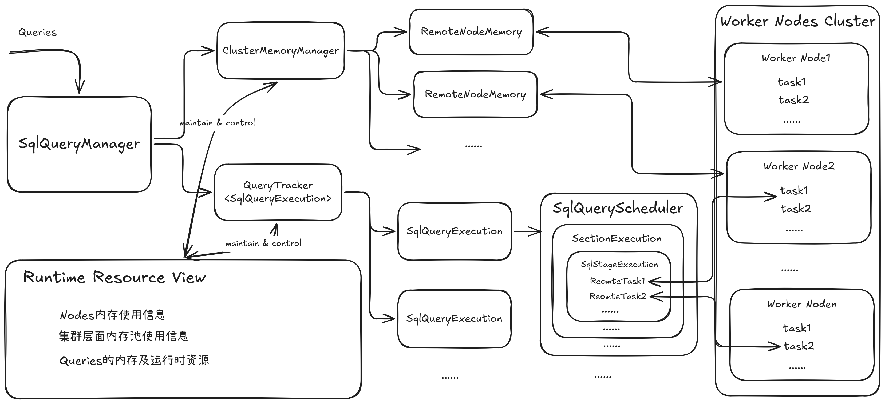

# Presto 查询引擎内核详解：集群资源管理机制解析

本文档详细阐述Presto集群中Coordinator和Worker两个核心角色如何协同完成资源管理（重点是内存），以确保查询高效、稳定地执行。

其核心思想可以概括为：

> **Coordinator 负责全局约束与策略决策，Worker 负责本地执行与精细化控制。**

需要特别强调的是，Presto 的资源管理并非“静态分配”，而是：

> 一个基于运行时反馈的动态控制系统（feedback-driven system）

## 第一部分：Coordinator端 —— 集群资源的“大脑”

Presto 的集群资源管理整体机制和架构如下图所示：

其中，Coordinator作为集群的协调管控节点，维护着所有节点和查询的全局视图，并据此执行全局性的资源管理策略。概括来说：

Coordinator 维护：

- 全局查询视图
- 集群节点状态
- 资源使用情况

并执行：

- 查询级调度控制（非执行调度）
- 全局资源仲裁（尤其是内存）

### 1.1 核心查询管理器：SqlQueryManager

SqlQueryManager是Coordinator端管理查询的单例服务。它不仅是所有查询执行的统一入口（createQuery方法），更是一个集监控、动态干预于一体的核心组件。

#### 关键内部组件

ClusterMemoryManager：集群统一内存管理器，也可以被称为全局内存资源仲裁器（Global Arbiter）。它从整个集群的视角，监控所有节点的内存使用
情况，并决定全局策略。例如，是否将某个查询提升至预留内存池（Reserved Pool）或终止内存超限的查询。负责全局内存压力检测、OOM 处理、内存池调整等。

QueryTracker<QueryExecution>：查询追踪器。维护所有运行中的查询实例（QueryExecution），并负责查询级别的超时、遗弃、任务数限制等管理。

QueryManagerStats：全局查询状态统计器，记录所有查询的执行状况。用以支撑 UI / metrics / event listener 等。

#### 周期性管理任务：

SqlQueryManager启动后，会以1秒为周期，在一个专用的queryManagementExecutor线程池中执行以下任务：

- enforceMemoryLimits()：调用ClusterMemoryManager的逻辑，进行集群级别的内存管理（如OOM Killer、提升查询至Reserved Pool）。
- enforceCpuLimits()：遍历所有查询，将CPU使用时间超过maxQueryCpuTime的查询标记为失败。
- enforceScanLimits()：遍历所有查询，将扫描的原始数据量超过maxQueryScanPhysicalBytes的查询标记为失败。
- enforceOutputSizeLimits()：遍历所有查询，将输出数据量超过maxQueryOutputSize的查询标记为失败。

这些后台任务本质上构成了一个以 1S 为周期运行的软实时控制循环（soft real-time control loop），也即：

> 周期性检测、反馈式控制；资源限制不会阻止查询启动，而是在执行过程中根据运行状态进行裁决。

这种运行时反馈控制机制与 Spark 主要依赖 pre-scheduling 的资源规划方式形成鲜明对比。

### 1.2 集群内存管理核心：ClusterMemoryManager

这是 Presto 最关键、也是最容易被低估的组件。其本质定位为：

> **集群级内存压力调度器**（pressure-driven scheduler）

ClusterMemoryManager是实现集群内存宏观调控的引擎，其process()方法由上述enforceMemoryLimits()方法周期调用，执行集群内存调控的核心逻辑。

核心职责与流程：

- 检测集群内存状态 (isClusterOutOfMemory)：
    - 判断是否有节点处于“阻塞”状态（无法再满足内存请求）（freeBytes + reservedRevocableBytes <= 0，即MemoryPool 无可用空间 且 revocable reclaim 不足）。如果存在这样的节点，则认为集群处于内存压力之下（Out Of Memory， OOM）。注意，这里的OOM是“调度阻塞信号”，不是 JVM OOM。
- 遍历并处理运行中的查询：
    - 资源无节制查询：若集群处于OOM状态，会立即终止标记了RESOURCE_OVERCOMMIT（允许资源过量使用）的查询。
    - 内存超限查询：对于普通查询，检查其用户内存（User Memory）和总内存（User + System + Revocable）是否超过会话或系统设定的限额，若超过则终止。
- 集群OOM Killer机制：
    - 如果集群仍处于OOM状态，本轮没有成功终止任何查询，且满足时间条件（距离上次非OOM状态超过killOnOutOfMemoryDelay，默认5分钟），则会调用LowMemoryKiller策略选择一个查询（例如，占用内存最大的）并终止它，以释放资源。
- 更新集群内存池视图 (updatePools)：
    - 根据从各个Worker节点收集到的内存信息，更新GENERAL_POOL和RESERVED_POOL这两个集群级内存池的统计信息。
- 决定并执行内存池调整 (updateAssignments)：
    - 核心策略：如果RESERVED_POOL未被使用，但GENERAL_POOL中存在阻塞节点，则会从GENERAL_POOL中选出一个内存占用最大的查询，“提升”到RESERVED_POOL中执行。
    - 此决策会封装成一个MemoryPoolAssignmentsRequest。
- 向所有Worker广播指令 (updateNodes)：
    - 将上一步生成的MemoryPoolAssignmentsRequest发送给集群中所有活跃的Worker节点，指示它们将特定查询的内存归属从GENERAL_POOL切换到RESERVED_POOL。
    - 注意：这是“逻辑归属切换”，不是数据迁移。

### 1.3 查询生命周期管理：QueryTracker

QueryTracker专注于查询实例的追踪与微观管理。其核心职责为：

- 维护运行中查询：通过ConcurrentMap<QueryId, QueryExecution> queries存储所有的活跃查询。
- 周期性执行检查（同样以1秒为周期）：
    - failAbandonedQueries()：基于客户端心跳超时，判定并终止被客户端遗弃的查询。
    - enforceTimeLimits()：根据查询的最大执行时间（Execution Time）和运行时间（Wall Time），终止超时查询。
    - enforceTaskLimits()：当集群总运行任务数超过阈值时，终止任务数最多的“过量”查询。
    - removeExpiredQueries() / pruneExpiredQueries()：清理历史查询记录，或对超出保留数量的查询进行信息裁剪以节省内存。

总结：QueryTracker 决定“查询是否应该继续存在”。

## 第二部分：Worker端——本地资源的“管家”

Worker 是计算真正发生的地方。每个Worker节点负责管理分配给自己的本地资源，并执行实际的计算任务，包括：

- Task、Pipeline 和 Driver 的生命周期管理
- 本地资源管理（内存、CPU 等）
- 本地执行调度（Task/Driver/Split）
- 实际数据处理（Operator Pipeline）

### 2.1 本地资源统一入口：SqlTaskManager

SqlTaskManager是Worker节点上管理所有接收到的任务（SqlTask）的单例服务。它维护着节点上所有查询和任务的本地上下文。

其持有的核心数据结构为 LoadingCache<QueryId, QueryContext> queryContexts：

> 这是一个以QueryId为键的缓存，为每个在本地执行的查询创建一个QueryContext。这实现了查询级别的内存隔离 —— 同一Worker上属于相同查询的所有任务，会共享同一个QueryContext及其内部的内存管理体系。

### 2.2 worker节点本地内存池：LocalMemoryManager

LocalMemoryManager代表了Worker节点对自身内存的划分。

内存池划分：根据配置（NodeMemoryConfig），Worker节点将可用堆内存（Runtime.getRuntime().maxMemory()）划分为：

- GENERAL_POOL：常规内存池，供大多数查询使用。
- RESERVED_POOL：预留内存池，大小通常等于单个查询在单节点上的总内存限额（maxQueryTotalMemoryPerNode）。此池专为Coordinator“钦点”的查询服务所预留，确保其在内存压力下仍能完成。
- HeapHeadroom：额外预留的内存空间，用于处理JVM内部或未追踪的内存分配，防止因Presto预留与实际使用偏差导致OutOfMemoryError。

📌 关键理解：

> MemoryPool 本质上是一个"内存资源许可（Resource Permit）管理器"，而不是内存分配器。

### 2.3 接收并处理Coordinator的指令：MemoryResource

Worker通过MemoryResource（HTTP端点/v1/memory）接收来自Coordinator的MemoryPoolAssignmentsRequest。

- 当收到请求后，会调用SqlTaskManager.updateMemoryPoolAssignments(request)。
- 该方法会遍历请求中的分配列表，对每个查询执行QueryContext.setMemoryPool()，将其内存归属在GENERAL_POOL和RESERVED_POOL之间切换。

### 2.4 查询级内存上下文：QueryContext

QueryContext是Worker上为单个查询创建的“资源容器”。它通过MemoryTrackingContext构建了一个层次化的内存追踪体系。

#### 层次化内存追踪体系 (MemoryTrackingContext):

该体系将查询在Worker上执行时产生的所有内存分配，按照Query -> Task -> Pipeline -> Driver -> Operator五个层级，以及User、System、Revocable三种类型进行精细化管理。

核心原理：

- 每个层级都有一个MemoryTrackingContext，内部包含三个聚合上下文（AggregatedMemoryContext）和三个本地上下文（LocalMemoryContext）。
- 聚合上下文：汇总本层级及其所有子孙层级的内存使用。
- 本地上下文：用于追踪本层级直接发起的内存分配（例如，ExchangeOperator在Pipeline层直接分配的系统内存）。
- 层次关系通过 newMemoryTrackingContext() 方法构建，该方法为父节点的每个聚合上下文创建一个子聚合上下文，形成树状结构。

上述每个层级的聚合内存上下文和本地内存上下文都各有三个，代表了三种不同的内存类型：

- User Memory		算子逻辑使用
- System Memory		用于记录 Buffer / Exchange 等的内存使用
- Revocable Memory	可被回收（spill）

#### 内存申请与预留流程 (MemoryPool & MemoryReservationHandler)：

“先用后记”模式：Presto的算子通常先实际使用JVM内存（如创建Java对象），再通过MemoryReservationHandler向MemoryPool“预留记账”。

内存预留接口 (MemoryReservationHandler)：

- reserveMemory()：用于内存预留。它会检查限额，更新MemoryPool内部的reservedBytes、queryMemoryReservations等统计信息，并返回一个ListenableFuture。如果内存紧张，这个future将处于阻塞状态，指示调用方在下次申请内存前需要阻塞等待。
- tryReserveMemory()：尝试性预留。如果内存不足，会立即返回false，避免实际使用后预留失败。这用于一些可以提前规划内存的操作。

内存预留核心 (MemoryPool)：MemoryPool并非实际分配内存，而是一个预留与控制器。它维护着每个Query、每个标签（Tag）的内存使用明细。当reservedBytes超过maxBytes时，会创建一个阻塞future，从而通过阻塞新的 reservation 请求，实现内存压力反馈，达到控制后续内存申请的目的。

📌 关键点：

Presto 使用 Future 的语义实现“协作式阻塞（cooperative blocking）”，即：

- 内存不足 → 后续涉及到内存申请的 Driver yield
- Pipeline 暂停执行

### 2.5 内存回收机制：MemoryRevokingScheduler

当内存紧张时，Presto并非被动等待OOM，而是主动触发内存回收（Spill to Disk，将内存数据溢出到磁盘）。典型场景包括：

- Hash aggregation
- Hash Join build side

触发器：MemoryRevokingScheduler 为 MemoryPool（如GENERAL_POOL）注册了一个监听器。每次成功预留内存（reserve/reserveRevocable）后，都会触发该监听器以执行相应的检查及回收操作。

涉及到的回收策略为：

- Query级回收：当一个查询的总内存使用超过其maxTotalMemory限制时，会触发针对该查询的内存回收。它遍历查询该Query之下的所有TaskContext，找到可撤销内存（revocableMemory）并请求回收。
- MemoryPool级回收：当内存池的可用内存低于阈值（memoryRevokingThreshold）时，会触发整个内存池级别的回收。它会从所有运行中的任务中，按策略（如可撤销内存大小）选出任务，请求其释放内存。

回收请求最终会设置到算子对应的OperatorContext的memoryRevokingRequested标志上。当Driver线程下次调度到该Operator时，会调用其startMemoryRevoke()方法执行真正的磁盘溢出操作，并释放内存。

### 2.6 查询终止时的资源清理

当Coordinator决定终止一个查询（如超时、OOM）时，会调用SqlQueryExecution.fail()，最终通过HTTP请求通知所有Worker终止相关任务。

Worker端清理流程（以DELETE /v1/task请求为例）：

- TaskResource.deleteTask() 接收到请求，调用SqlTaskManager.abortTask()。
- 状态机转换：SqlTask持有的TaskStateMachine状态转换为ABORTED或CANCELED。状态变更会触发一系列监听器。
- 监听器链式清理：
    - 其中一个监听器会调用SqlTaskExecution中的逻辑，从TaskExecutor中移除任务句柄，并销毁所有PrioritizedSplitRunner。
    - 另一个监听器会调用OutputBuffer的fail()或destroy()方法，清理输出缓冲区。
    - 最后，PrioritizedSplitRunner.destroy() 会关闭其内部的Driver。
- Driver关闭：Driver.close() 将自身状态改为DESTROYED，并调用 closeAndDestroyOperators()。
- Operator清理：该方法遍历并关闭所有Operator实例（调用其close()方法），并销毁其OperatorContext。OperatorContext.destroy()会逐级向上调用close()，最终通过RootAggregatedMemoryContext向MemoryPool释放该查询所占用的全部内存预留。

📌 核心特征：

> 资源释放是一个自底向上的级联过程

### 2.7 输出缓冲区内存管理：OutputBufferMemoryManager

OutputBufferMemoryManager是Worker上管理输出缓冲区的专用组件，它封装了LocalMemoryContext来管理系统内存。

- 阻塞机制：当缓冲区数据量超过maxBufferedBytes且blockOnFull标志为true时，其getBufferBlockedFuture()方法会返回一个未完成的future。这会导致试图向该缓冲区写入数据的Producer（上游Operator）被阻塞，实现背压（Backpressure）机制。
- 动态调整：当Task结束（setNoMorePages()）或被销毁（destroy()/fail()）时，会调用setNoBlockOnFull()，解除阻塞状态，因为已不会有新数据写入了。

## 总结

Presto的资源管理体系通过Coordinator的全局视角和Worker的本地精细控制，实现了高效、可靠的查询执行：

- Coordinator 像一位“空中交通管制员”，掌握全局，制定并下发资源分配策略，解决全局性冲突（如OOM）。
- Worker 像一位“机场地勤”，管理本地资源，通过层次化预留体系、主动回收机制（Spill） 和背压机制（Buffer Blocking），确保资源被有效利用，并在接收到指令时快速完成资源清理。

Presto 资源管理的本质模型可以抽象为三层：

- 1 控制层（Coordinator）
    - OOM 决策
    - Query kill
    - Pool 调整
- 2 执行层（Worker）
    - 内存预留 / 资源释放
    - Driver 调度
    - 阻塞 / 唤醒
- 3 反馈层（Runtime Signals）
    - MemoryPool blocked
    - Revoking trigger
    - Buffer full

👉 三者形成：

> 闭环控制系统（Closed-loop Control System）

最后用用一段话概括，Presto 的资源管理体系通过层次化内存预留、Future-based 阻塞机制、Revocable spill 内存回收机制、全局 OOM 仲裁等机制，共同实现在不可预知负载下的稳定执行能力。和resource manager体系相配合，共同保障了Presto在多租户、高并发场景下的性能和稳定性。
