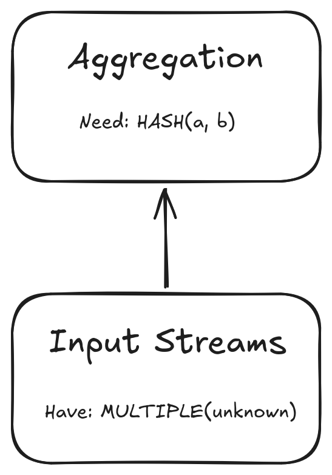
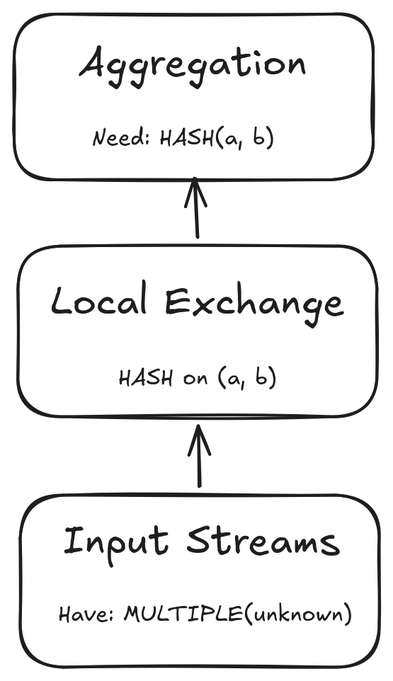
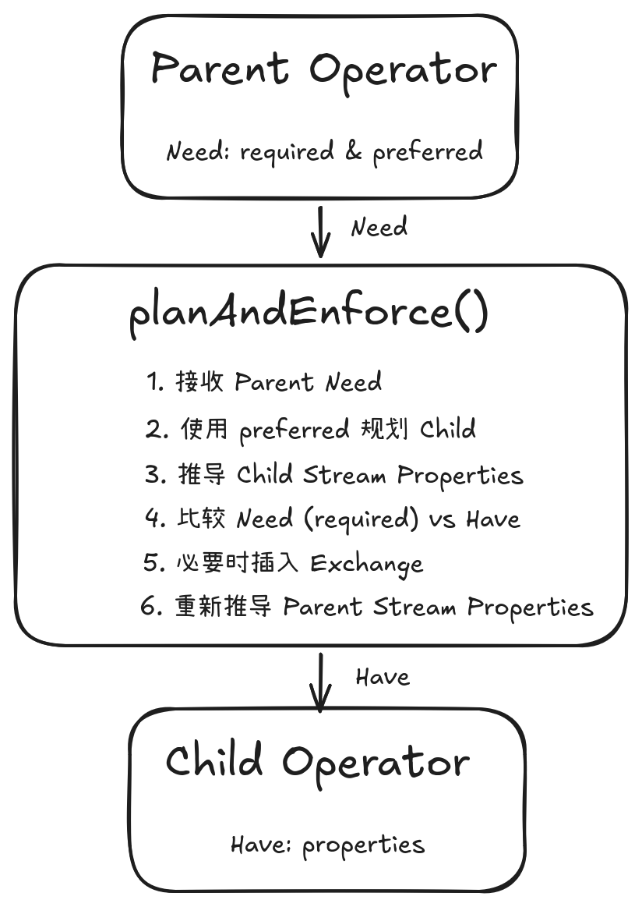

# Presto 查询引擎内核详解：AddLocalExchanges——基于数据流属性约束的本地执行规划

#### 优化器如何解决算子间的数据流不匹配问题

---

## 一、为什么 Planner 需要 AddLocalExchange？

在查询优化器（Optimizer）对逻辑计划进行物理规划（Physical Planning）时，一个核心问题始终存在：

> 如何确保每个算子（Operator）都能获得符合它真正要求的数据流（Dataflow）？

这里所说的数据流，并不是数据本身，而是数据在本地执行环境中的组织方式，例如数据是否按照某些列进行分区、是否保持特定顺序、以及由多少并行执行实例消费等。

不同算子对数据流有着不同的要求。例如：

- Aggregation 需要相同 Group Key 的数据进入同一个数据分区（Data Partition），从而保证负责该分区的执行实例能够维护完整的聚合状态。
- Sort 希望最终获得单个有序的数据流，以保证全局排序结果正确（当然这也并非绝对，在支持分布式排序的情况下，Sort 需要 FIXED distribution 的数据流）。
- TableWriter 则可能要求固定并行度的数据流，以满足写入策略的要求。

然而，上游算子天然产生的数据流，并不一定能够满足下游算子的执行要求。

换句话说，Operator 与 Operator 之间的数据流并不是自然而然就兼容的（Dataflow Mismatch）。

因此，在物理规划阶段，Optimizer 必须负责协调这种数据流的不匹配，而不是把这一职责交给各个算子自己完成。

> 说明：从数据流规划角度，数据分区（Partition）描述数据应该如何被划分和路由，执行实例则描述“哪些实例负责消费这些分区数据”。Local Exchange 的作用，就是建立两者之间的映射关系。

### 一个典型的例子

例如下面这个查询：

```sql
SELECT a, b, COUNT(*)
FROM t
GROUP BY a, b;
```

对于 Aggregation 来说，它真正需要的是：

```text
Need:
HASH on (a, b)
```

也就是说，相同 (a,b) 的数据必须进入同一个执行分区，使对应的 Aggregation driver（执行实例） 能够维护完整的聚合状态。

而上游输入节点（例如未携带有效分区信息 TableScan 或 Remote Exchange）往往会提供类似于：

```text
Have:
MULTIPLE (unknown)
```

即多个并行的数据流。这里的 unknown 指的是 Optimizer 无法证明数据已按特定列分区。

因此，上下游算子之间产生了数据流属性的不匹配：

<div align="center">
  
</div>

为了满足 Aggregation 的执行要求，Optimizer 必须主动插入一个 Local Exchange，重新组织数据流：

<div align="center">
  
</div>

需要注意的是，Local Exchange 改变的是数据流的组织方式，而不是数据本身。它负责在本地执行环境中重新组织输入数据流，将数据按照目标分区方式分发给下游执行实例，使下游 Operator 获得满足执行要求的数据布局。

### AddLocalExchanges 的职责

这正是 AddLocalExchanges 优化规则存在的原因。

它是 Optimizer 在物理规划阶段负责**本地数据流规划**（Local Dataflow Planning）的核心组件，其职责可以概括为三点：

- 判断上下游算子之间是否存在数据流不匹配（Need vs Have）；
- 在必要的位置插入合适类型的 Local Exchange，对数据流进行重组；
- 在插入 Local Exchange 后重新推导数据流属性，确保整个执行计划始终满足各个算子的执行要求。

### AddLocalExchanges 在优化流程中的位置

在 Presto 的物理计划优化阶段，Exchange 相关处理由多个优化规则共同完成，各阶段关注的问题不同。其中，AddExchanges 主要负责生成 Remote Exchange，解决跨 Worker 节点的数据重分布问题，例如根据 Join Key 或 Grouping Key 将数据发送到正确的执行节点。

AddLocalExchanges 位于 AddExchanges 之后，主要负责生成 Local Exchange，解决单个 Worker 内部不同 Pipeline 执行片段（Driver）之间的数据组织问题。即使 Remote Exchange 已经保证相同 Key 的数据位于同一个 Worker，仍需要保证这些数据在 Worker 内部进一步按照执行需求进行组织，从而满足 Aggregation、Join 等算子的输入属性要求。

需要注意的是，AddLocalExchanges 的核心目标是保证物理计划的正确执行，而不是进行成本优化。它通过算子语义推导数据流属性，并在属性不满足时插入必要的 Local Exchange。至于 Exchange 是否冗余、是否可以消除、并行度是否最优、是否存在更低成本的数据流方案，则由后续优化规则（如 Exchange 简化、冗余消除以及其他物理优化阶段）进一步处理。

在介绍完 AddLocalExchanges 优化规则所处的位置和其职责之后，一个新的问题也随之产生：

> Optimizer 如何知道一个算子需要什么样的数据流？又如何判断上游算子实际提供了什么样的数据流？

为了回答这两个问题，Presto 引入了一套完整的**数据流属性约束机制**（Dataflow Property Enforcement Mechanism）。下一章将围绕这一机制展开，分析 AddLocalExchanges 如何通过"声明需求、比较属性、重组数据流"来完成整个本地数据流规划过程。

## 二、数据流属性约束机制（Dataflow Property Enforcement Mechanism）

### 2.1 数据流属性约束

理解了"为什么需要"之后，我们来看 AddLocalExchanges 的设计哲学。想要理解 AddLocalExchanges，首先需要理解 Optimizer 如何在物理规划阶段分析并满足 Operator 对数据流属性的要求。本文将这一过程概括为“数据流属性约束机制”。

简单来说：

> **数据流属性约束**描述了 Operator 对输入数据流属性的要求，以及 Optimizer 如何通过属性推导、需求匹配和 Exchange 插入等机制，将逻辑上的算子需求转换为满足执行要求的物理数据流组织方式。

在这一机制中：

- Parent Operator 声明需求（Need），例如：
    - HASH partitioning on (a,b)
    - SINGLE data stream
    - ORDERED data stream
- Child Operator 提供实际数据流属性（Have），例如：
    - 已经按照 (a,b) 分区
    - 未知分区
    - 多个并行输入流
- Optimizer 负责协调两者之间的差异
    - 如果满足需求，直接连接；
    - 如果不满足，则插入 Local Exchange 进行数据流转换。

注意：这里的 Parent / Child 指 Plan Tree 中的父子关系，数据流实际方向是由 Child 流向 Parent。

<div align="center">
  
</div>

### 2.2 数据流属性约束的核心价值

Optimizer 不要求每个算子自己产生正确分布的数据流，而是允许算子只声明"需要什么"，由优化器负责在必要时重组数据流。

这意味着：

- 算子可以专注于业务逻辑（聚合、连接、排序等）
- 数据流管理由优化器统一负责
- 整个系统更模块化、更可扩展

这实现了 Operator 计算逻辑与数据流管理逻辑的解耦，使新的 Operator 可以专注于计算语义，而无需自行处理数据重新分布问题。

### 2.3 数据流属性约束的实施者

在 AddLocalExchanges 的优化过程中，planAndEnforce() 是数据流属性约束机制的核心实施入口。它负责接收 Parent Operator 的属性需求，规划 Child Operator 并获取其实际属性，在需求不满足时插入对应的 Local Exchange。

## 三、数据流属性系统——如何描述算子对数据流的 Need 与 Have

### 3.1 为什么需要统一的属性描述？

有了前面数据流属性约束的概念，我们现在需要一个核心工具：一套统一的语言来描述"当前算子需要什么"和"上游算子实际提供什么"。

如果没有统一的描述语言：

- Aggregation 说"我需要 HASH 分区"
- TableScan 说"我提供 MULTIPLE 数据流"
- 两者说的不是同一套概念，无法比较

因此，Presto 引入了一套数据流属性描述体系。其中，StreamPreferredProperties 用于描述 Parent Operator 对输入数据流属性的期望要求，StreamProperties 用于描述 Child Operator 实际产生的数据流属性。

### 3.2 StreamPreferredProperties：描述 Operator 的输入数据流属性需求

父节点用 StreamPreferredProperties 向子节点表达需求：

```java
public class StreamPreferredProperties {
    private final boolean singleStream;          // 是否期望单流
    private final boolean fixedParallelism;      // 是否期望固定并行
    private final Optional<List<VariableReferenceExpression>> partitioningColumns; // 期望分区列
    private final boolean orderSensitive;        // 是否对排序敏感
}
```

需要注意的是，父节点表达的需求包含两种类型：Required Properties 和 Preferred Properties，它们都使用 StreamPreferredProperties 进行定义。

planAndEnforce() 的执行流程并不是直接使用 Required Properties 强制修改子节点，而是首先利用 Preferred Properties 递归规划子节点，使其产生实际的
数据流属性（StreamProperties）。随后，Planner 再将子节点实际提供的属性（Have）与父节点要求的 Required Properties（Need）进行匹配。如果实际属性
已经满足 Required，则直接复用当前计划；如果不满足，则进入 enforce() 阶段，通过插入 Local Exchange 对数据流进行重组，使其最终满足算子的执行要求。

### 3.3 StreamProperties：描述 Operator 输出的数据流属性

```java
public class StreamProperties {
    // 数据流在 Pipeline 间的分布
    public enum StreamDistribution {
        SINGLE,    // 单个本地数据流
        MULTIPLE,  // 多个数据流，分区未知
        FIXED      // 多个数据流，按照明确 partitioning scheme 分布
    }

    private final StreamDistribution distribution;
    private final Optional<List<VariableReferenceExpression>> partitioningColumns;
    private final boolean ordered;
    // ...
}
```

其描述的核心问题是：数据分布在多少个数据流中？在哪些列上分区？是否有序？

### 3.4 分布类型的本地语义

| 类型     | 本地语义     | 典型场景                   |
| :------- | :--------- |:-----------------------|
| SINGLE | 单个数据流   | VALUES、GATHER 之后       |
| MULTIPLE   | 多个数据流，分区未知   | TableScan、REPLICATE 之后 |
| FIXED | 多个数据流，分区明确   | REPARTITION 之后         |

### 3.5 分区列的包含关系

这是一个容易被误解但很重要的概念：

```text
// 当前流在 (a, b) 上分区
// 判断能否满足在 (a, b, c) 上分区的要求？
// 答案：可以！相同的 (a,b,c) 值一定在同一个分区中
actual.isPartitionedOn([a, b, c]) → true

// 当前流在 (a, b, c) 上分区
// 判断能否满足在 (a, b) 上分区的要求？
// 答案：不可以！相同的 (a,b) 值可能分布在不同分区（c 不同）
actual.isPartitionedOn([a, b]) → false
```

这个逻辑在本地 Pipeline 间同样适用，决定了哪些操作可以在不 shuffle 的情况下完成。

### 3.6 ActualProperties：完整的物理属性描述

除了分布属性，Planner 还需要知道 Pipeline 内部的属性：

```java
public class ActualProperties {
    private final Optional<DistributionType> global;  // 跨节点分布
    private final List<LocalProperty<VariableReferenceExpression>> localProperties; // 排序、分组
    private final List<VariableReferenceExpression> constants; // 常量列
    // ...
}
```

两者的关系：


| 属性类型     | 关注维度     | 描述内容                   |
| :------- | :--------- |:-----------------------|
| StreamProperties | Pipeline 之间   | 数据如何分布在多个 Pipeline（AddLocalExchanges 专门关心）       |
| ActualProperties   | Pipeline 内部 + 全局   | 完整的物理属性描述，包含分布、排序、常量等 |

一个更准确的理解：

- StreamProperties：AddLocalExchanges 专门关心的数据流分布抽象
- ActualProperties：Planner 推导出的完整物理属性描述

从关注范围来看，StreamProperties 可以理解为 ActualProperties 中与本地数据流组织相关的一部分属性抽象，是 AddLocalExchanges 进行本地数据流规划时重点关注的信息。

### 3.7 数据流属性约束体系的整体流程

```text
Operator 根据自身语义定义属性需求
        ↓
Visitor 将这些规则编码为 Planner 可执行逻辑
        ↓
StreamPreferredProperties 描述 Need
        ↓
StreamProperties 描述 Have
        ↓
planAndEnforce() 执行规划，并比较 Need 与 Have
        ↓
匹配：直接复用现有数据流
不匹配：插入 Local Exchange
        ↓
重新推导输出属性
```

## 四、Operator 的数据流属性语义

前面介绍了 Presto 如何使用 StreamProperties 描述当前数据流状态，以及使用 StreamPreferredProperties 表达算子的输入需求。

但是，Optimizer 如何知道一个算子需要什么样的数据流？又如何知道其执行完成后数据流会具有什么属性？

答案是：

> 每个 Operator 都定义了自身的数据流属性语义（Dataflow Property Semantics），用于描述输入约束和输出属性。

这些语义是物理规划阶段进行属性推导和 Exchange 插入的基础。

### 4.1 输入需求与输出属性

对于一个 Operator，Optimizer 需要关注两个问题：

#### 1. 对输入数据流的需求和建议（Input Requirement & Preferred）

> 当前算子需要以及建议上游提供什么样的数据流。

例如：

- 某些算子要求数据按照特定字段分区；
- 某些算子要求单流执行；
- 某些算子要求输入满足排序条件。

这些需求最终通过 StreamPreferredProperties 来定义，用于指导子节点规划，并执行数据流属性约束。

#### 2. 实际输出数据流的属性（Output Property）

> 当前算子被规划并执行之后，下游节点可以依赖的数据流特征。

例如：

- Filter 通常保持输入的数据分布；
- Exchange 会改变数据分布；
- Project 会根据字段映射传播已有属性；
- 某些算子会丢失部分输入属性。

这些结果会通过 StreamProperties 来定义，用于后续节点的属性推导。

### 4.2 算子语义与物理规划的关系

需要注意：

> AddLocalExchanges 并不关心算子的具体执行逻辑，而只关心算子对数据流组织形式的要求。

例如，Aggregation 在执行层面可能涉及：

- Hash Aggregation；
- Streaming Aggregation；
- Partial / Final Aggregation。

但在数据流规划阶段，Planner 只需要知道：

> grouping key 是否满足数据聚合要求

Join 也不关心具体 Join Operator 如何执行，而关注：

> 输入数据分布是否满足 Join 策略要求

因此，Operator 属性语义提供的是一种物理约束抽象，而不是执行实现描述。

### 4.3 Operator 属性语义与 Visitor

在源码实现中，Operator 的属性语义通过 Visitor 模式进行编码。

Visitor 模式的本质：其本身并不是优化算法，而是将不同 PlanNode 对输入数据流属性的要求，以及它们产生的输出属性，编码为 Optimizer 可以理解和操作的形式。真正负责比较 Need 与 Have、插入 Exchange、重新推导属性的是 planAndEnforce() 方法。

> Visitor 定义的是“属性语义”，而 planAndEnforce() 执行的是“满足属性约束”。

说明：Operator 属性语义与具体执行策略密切相关，并且仍处于持续演进过程中，不同版本之间可能存在差异。因此，本文只讨论其在物理规划中的抽象作用：即算子如何声明数据流约束，以及 Planner 如何基于这些约束完成属性推导和 Exchange 调整。对于具体算子的当前实现细节，建议直接参考对应版本源码。

## 五、planAndEnforce —— 属性约束满足的核心流程

前面的章节介绍了：数据流不匹配问题、属性约束机制、属性描述语言、算子属性语义等。现在需要一个过程，将这些属性语义转换为满足约束的物理计划。

planAndEnforce() 正是完成这一过程的核心方法。它接收父节点的属性需求，递归处理子节点，比较需求与实际属性的差距，在必要时插入 Local Exchange 重组数据流，最终确保每个节点都获得满足执行要求的数据流。

### 5.1 planAndEnforce 的职责

planAndEnforce() 的核心职责概括为六步：

- Step 1: 接收需求   ── 从父节点获取 Required 和 Preferred 属性需求
- Step 2: 递归规划   ── 使用 Preferred 建议对每个子节点进行递归规划，传递裁剪后的需求
- Step 3: 收集属性   ── 收集子节点规划处理后的实际数据流属性
- Step 4: 比较判断   ── 检查 Have 是否满足 Need (Required)
- Step 5: 修正实施   ── 不满足时插入 Local Exchange，重新推导属性
- Step 6: 返回属性   —— 将当前节点输出属性作为父节点的 Have

其核心思想是：

> 不断将父节点的建议需求（preferred）向下传播，并在数据流无法满足强制要求（required）时，通过 Exchange 主动修正。

方法签名如下：

```java
private PlanWithProperties planAndEnforce(
    PlanNode node,
    StreamPreferredProperties required,  // 父节点必须满足的需求
    StreamPreferredProperties preferred); // 父节点偏好的需求（优化提示）
```

PlanWithProperties 返回值包含处理后的节点及其产出的实际数据流属性。

**Required vs Preferred**

- Required 是硬约束：不满足时 Planner 必须通过 Exchange 等机制进行修正。如 Aggregation 必须在 grouping keys 上分区。
- Preferred 是软约束：满足可提升性能，不满足也正确。如某些节点"偏向"单流处理。

**属性需求裁剪**

在递归规划过程中，父节点的需求不会直接传递给所有子节点。而是会根据子节点实际输出的数据列，对需求进行裁剪：

```text
           Join
      Need: HASH(a, b)
          /          \
    Left Child    Right Child
   输出: a, c      输出: b, d

   ↓ 裁剪后传递         ↓ 裁剪后传递
   Need: HASH(a)      Need: HASH(b)
```

确保每个子节点只接收与自己相关的需求。

### 5.2 Need vs Have：StreamPreferredProperties 如何判断属性满足

递归规划完成后，Planner 会比较：

- Need: 父节点要求的数据流属性
- Have: 子节点实际产生的数据流属性

属性匹配本质上是：判断已有数据流属性是否足够支持当前算子的执行要求。例如：

> 更强的数据流属性可以满足较弱的数据流需求

典型情况例如：

```text
SINGLE + ORDERED 可以满足 SINGLE

HASH(a) 可以满足 HASH(a, b)	--分区包含关系（isPartitionedOn）详见上面3.5节的说明
```

综上所述：isSatisfiedBy() 并不是简单比较 distribution 是否完全相等，而是根据数据流属性的强弱关系判断是否满足。在属性匹配过程中，Planner 会根据 StreamProperties 的 distribution、partitioning 和 ordering 判断 Child Stream Properties 是否满足 Parent Requirement。如果不能满足，则进入 enforce 阶段。

### 5.3 enforce：通过 Local Exchange 修正属性

在 enforce 阶段，Planner 根据缺失的属性类型插入对应的 Local Exchange。如下所示：


| Exchange 类型     | 属性变化                    | 典型场景                   |
| :------- |:------------------------|:-----------------------|
| GATHER | 任意 → SINGLE             | 全局排序、最终汇聚       |
| HASH REPARTITION   | 任意 → FIXED partitioning | Aggregation、Join |
| ROUND ROBIN   | 任意 → MULTIPLE           | 并行负载均衡 |

例如：

```text
Aggregation 需要：HASH(a, b)，但输入数据流为：MULTIPLE，则：

              HASH Exchange on (a, b)
MULTIPLE  -----------------------------> FIXED(a, b)
```

插入之后 Aggregation 即可正确执行。

### 5.4 Exchange 后重新推导属性

由于 Exchange 改变了数据流组织形式，因此插入 Exchange 后必须重新计算属性。

例如：

```text
插入前数据流分布为 MULTIPLE 或 FIXED，插入后数据流分布变为了 SINGLE

插入前数据流分布为 SINGLE 或 MULTIPLE，插入厚数据流分布变为了 FIXED(a, b)
```

因此，在 Local Exchange 插入之后，我们需要重新执行属性推导（derive properties）以得到新的数据流属性（StreamProperties）。

属性推导是自底向上的：子节点属性会向上传播并决定父节点属性。planAndEnforce() 返回前通过 checkState() 验证所有硬约束均已满足，确保计划执行时不会因数据流属性不匹配而失败。

总结：planAndEnforce() 通过"递归规划 → 属性比较 → 插入 Exchange → 重新推导"的闭环，将算子属性语义转化为满足约束的物理执行计划，是 AddLocalExchanges 优化规则得以实施的核心引擎。

## 六、完整执行流程示例：Local Exchange 如何完善执行计划

需要注意的是，Presto 的物理计划生成通常包含两个层面的数据重组：

- Remote Exchange：解决 Task/Stage 之间的数据传输和重新分区问题；
- Local Exchange：解决单个 Task 内部多个 Pipeline 之间的数据组织问题。

本示例重点关注 AddLocalExchanges 如何基于已有物理计划属性调整 Local 数据流。Remote Exchange 仅作为背景展示，不展开分析。

以如下的分组聚合语句作为示例：

```sql
SELECT a, b, COUNT(*) FROM t GROUP BY a, b;
```

经过前序物理规划后，计划已经包含跨 Task 数据重分布：

```text
              Output
                 |
          RemoteExchange(GATHER)
                 |
            Aggregation
                 |
          RemoteExchange(MULTIPLE)
                 |
            TableScan
```

这里：

- RemoteExchange(MULTIPLE) 负责 Stage 间的数据重新分区。
- 但是在每个 Task 内部，仍然需要确定各 Pipeline 如何消费这些数据。

AddLocalExchanges 处理 Aggregation 的实际行为如下所示：

1. 初始计划片段：

```text
          Aggregation
               |
          RemoteExchange
          (MULTIPLE)
```

2. planAndEnforce() 开始执行：

> 对于 Aggregation 节点，处理逻辑为：
- 递归处理子节点 RemoteExchange
    - 规划并获取 RemoteExchange 的输出数据流分布类型: MULTIPLE
- 比较 Aggregation Need vs RemoteExchange Have
    - Need: FIXED on (a,b)
    - Have: MULTIPLE, 分区未知
    - 不匹配！
- 调用 enforce()
- 插入 LocalExchange (HASH on a,b)

3. 修正后计划：

```text
              Output
                 |
          RemoteExchange(GATHER)
                 |
          Aggregation
                 │
          LocalExchange (HASH on a,b)   ← 插入的 Local Exchange
                 │
          RemoteExchange(MULTIPLE)
                 |
            TableScan
```

4. 重新推导属性：

- LocalExchange 后: FIXED on (a,b)
- Aggregation 后: FIXED on (a,b)（继承了分区特性）
- Output 检查: 可以接受多流（排序敏感允许保留）

5. 校验，最终计划满足所有需求。

## 七、总结

AddLocalExchanges 本质上解决的是查询执行计划生成过程中的一个核心问题：

> 如何将逻辑算子所表达的计算语义，转换为满足执行要求的数据流组织方式。

在分布式查询引擎中，不同算子对输入数据流具有不同约束，例如 Aggregation 需要满足 grouping key 的分区要求，Join 需要满足关联键的数据布局要求，Sort 和 TableWriter 也分别依赖特定的数据流属性。

这些约束并不是由算子自身完成协调，而是由 Optimizer 通过属性抽象和约束满足机制统一处理。

AddLocalExchanges 通过 Visitor 定义算子属性语义，利用 StreamPreferredProperties 和 StreamProperties 描述需求与实际状态，并由 planAndEnforce() 递归的完成属性传播、需求匹配以及必要的 Exchange 插入。

从设计思想上看，AddLocalExchanges 体现了现代查询优化器中的 Property Enforcement 模型：

> Optimizer 不直接决定执行细节，而是通过物理属性描述执行约束，再由规划规则自动调整数据流，使最终执行计划满足所有算子要求。

因此，Local Exchange 并不是简单的数据搬运节点，而是连接算子语义与物理执行的数据流控制机制。它将逻辑计划中的计算需求逐步转换为满足并行执行要求的数据流结构，是 Presto 从逻辑计划走向可执行物理计划的重要阶段。
