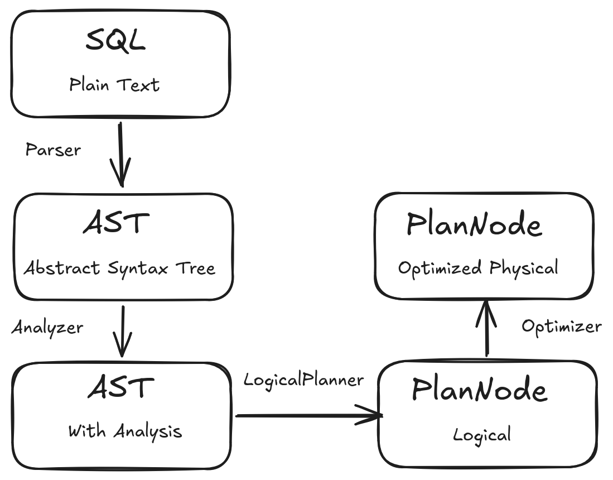
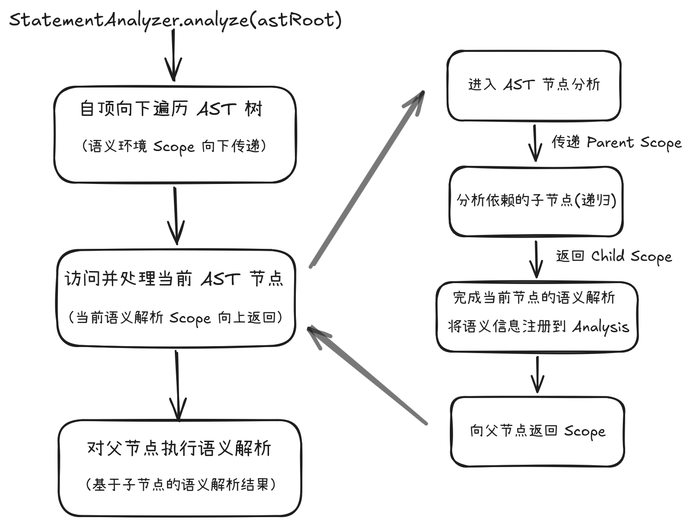

# Presto 查询引擎内核详解：SQL Analyzer 语义分析机制——从 AST 到 Analysis

## 1. 概述

在 Presto 查询引擎中，一条 SQL 语句从文本形式到最终可执行的物理计划，需要经历一系列处理阶段：

<div align="center">
  
</div>

其中，Parser 阶段只负责将 SQL 文本转换为抽象语法树（AST），它描述的是 SQL 的语法结构，但并不包含任何语义层面的理解。

以一条简单的查询为例：

```
SELECT name
FROM customer
```

Parser 只能得到：

> Identifier("name")

然而，这个标识符背后所蕴含的语义信息，Parser 完全无从知晓：

- name 属于哪个表或子查询；
- 该字段的数据类型是什么（VARCHAR、INT 还是其他）；
- customer 对应的是哪张物理表，其元数据信息如何获取；
- 后续执行时应当使用哪个函数或数据源对象。

这些关键的语义信息，正是 Analyzer 阶段需要填充的空白。Analyzer 的核心产物是 Analysis 对象，它承载了 SQL 从语法结构转换为语义模型过程中所产生的全部解析信息。

## 2. Analysis：Analyzer 的语义分析结果

Analysis 是 Presto Analyzer 阶段最终交付的核心成果。它并非某种单一维度的信息，而是一个各种类型及各种层次的语义分析结果的聚合容器，维护着 AST 节点与各类语义对象之间的映射关系。

从逻辑层面来看，Analysis 可以视作如下的结构：

```
Analysis
   |
   +-- Expression -> Type
   +-- Expression -> ResolvedField
   +-- Table -> TableHandle
   +-- FunctionCall -> FunctionHandle
   +-- Node -> Scope
   +-- ...
 ```

其中：

- Type：记录每个表达式经过类型推导后得到的数据类型；
- ResolvedField：记录标识符经过语义解析后最终指向的具体字段；
- TableHandle：记录 SQL 中引用的表名对应的具体数据源句柄；
- FunctionHandle：描述函数调用对应的具体函数实现句柄；
- Scope：为具有查询语义边界的 AST 节点（如 QuerySpecification、Relation、Subquery 等）提供字段可见性的描述，即该节点所能感知的字段集合和关系类型。
- 等等...

因此：

> Analysis 是在 AST 的语法骨架之上构建的一层语义完形，它充当着连接 SQL AST 世界与查询执行计划世界的语义映射桥梁。

## 3. Scope：SQL 语义作用域模型

### 3.1 Scope 的定义

Scope 是 Presto Analysis 中用于描述 SQL 语义作用域（semantic scope）的核心结构。

从本质上看：

> Scope 表示某个 AST 节点经过语义分析后形成的语义输出模型，描述该节点对外暴露的 RelationType、Field 以及其他命名语义信息（例如 Named Query），这些信息被其他分析过程用于 Identifier 解析和语义绑定。

其中最核心的信息是：

```
RelationType relationType
```

它描述该 AST 节点作为一个 SQL Relation 时，对外可见的字段集合。

例如，对于查询语句：

```
SELECT name FROM customer;
```

假设：customer 表包含 (id, name, age) 三个字段。

经过 Analyzer 分析之后，customer 表所对应的 Scope 信息为：

```
Table (customer) Scope

RelationType:
    +--id int
    +--name varchar
    +--age int
```

这表示：customer 这个 Relation 对外暴露（可见）的字段为 id, name, age。

而整个 QueryBlock 所对应的 Scope 信息为：

```
QuerySpecification Scope

RelationType:
    +--name varchar
```

这表示：该 QuerySpecification 对外暴露（可见）的字段只有 name。

因此，Scope 描述的是：一个 SQL 语义节点在关系模型中的对外语义输出信息。这些信息同时也是后续语义分析的重要输入。

### 3.2 Scope 在 Analysis 中的组织方式

Scope 并不是独立存在的全局结构，而是 Analysis 中维护的一类语义信息。

源码逻辑上：

```
Map<Node, Scope> scopes;
```

表示：Scope 是映射到特定 AST Node 上的语义分析结果。

例如，上述查询对应的 AST 语法树为：

```
Query
 |
 +-- QuerySpecification
        |
        +-- Select
        +-- Where
              |
              +-- Table(customer)
```

经过语义分析之后，对应的 Scope 映射信息为：

```
Query --> Scope(Query)
QuerySpecification --> Scope(QuerySpecification)
Table(customer) --> Scope(Table)
```

因此，Scope 在 Analysis 中本质上是一种 Node -> Scope 的平铺映射关系，而不是一棵与 AST Tree 完全对应的 Scope Tree。

这是因为，并不是每一个 AST 节点都需要维护自己专门的 Scope。只有那些能够形成独立 Relation 输出，或者引入新的 SQL 语义边界的节点，才需要 Scope，典型的包括：

- Query；
- QuerySpecification；
- Relation；
- Subquery 等等

反之，Projection、Filter、Join 条件中的表达式节点等等都不会专门创建 Scope，它们只是在所属 Scope 中完成字段解析和类型推导。

### 3.3 Scope 的 Parent 关系与外部语义访问

虽然 Scope 在 Analysis 中整体表现为：

```
Node -> Scope
```

的平铺映射关系，但是 Scope 本身却包含了：

```
Optional<Scope> parent
```

用于描述特殊情况下的外部语义访问关系。

需要强调的是：

> Scope.parent 并不是 AST 父节点对应的 Scope，而是当前语义节点可以访问的外部语义环境。

一个典型场景是 Correlated Subquery。例如，对于如下的语句：

```
SELECT *
FROM orders o
WHERE EXISTS (
    SELECT 1
    FROM customer c
    WHERE c.id = o.customer_id
);
```

对于内部 Query 来说，其可以通过 customer 表对应的 Scope 来解析 c.id：

```
Table (customer) Scope

RelationType:
    +--id int
    +--name varchar
    +--...
```

但是，对于 o.customer_id 来说，由于来自外层 Query，所以必须将来自外层的包含了表 orders 信息的 Scope 传递进来才能完成语义解析：

```
Outer Scope

RelationType:
    +--orders.customer_id int
    +--orders.customer_name varchar
    +--...
```

在实际执行字段解析时，查找方向为：

```
Current Scope
      |
      v
Parent Scope
      |
      v
继续向上查找
```

直到找到匹配字段。

这种关系更多来自 SQL 语义依赖，而不是 AST 父子层级关系。另一个典型场景是 lateral join，其右子树需要接收左子树对应的 Scope 作为其 Parent，才能完成语义解析。

### 3.4 Scope 的核心作用总结

综合来看，Presto 中的 Scope 可以理解为：

```
AST Tree --> AST Node
         |
         | Analyzer
         v
Analysis --> Scope
              |
              +-- RelationType
              |       |
              |       v
              |   对外暴露字段
              |
              +-- Named Query
              |
              +-- Parent Scope
                     |
                     v
                 外部语义访问链
```

它承担两个核心职责：

👉 描述 AST 节点分析后的语义输出，诸如：

- Relation 输出字段；
- QueryBlock 输出字段；
- Named Query 信息。

👉 通过 Parent Scope 支持跨 QueryBlock 的语义引用，例如：

- Correlated Subquery；
- CTE-based query；
- Lateral Join。

因此：

Scope 并不是 AST 的镜像结构，也不是简单的变量查找表，而是 Presto Analyzer 为 SQL 语义模型建立的 Relation 输出接口和名称解析基础设施，为 Identifier Resolution 提供字段绑定依据。

## 4. Analyzer 的语义分析模型

Presto Analyzer 本质上是一个基于 AST Visitor 的语义分析过程。它的核心任务是在 Parser 生成的 AST 基础上，结合数据库元数据和 SQL 语义规则，建立完整的语义模型，并将分析结果保存到 Analysis 中。

整体过程可以理解为：

<div align="center">
  
</div>

Analyzer 并不是简单地遍历 AST 节点并记录信息，而是在递归分析过程中：

- 根据当前节点的语义规则，驱动其依赖的子节点进行分析；
- 在必要情况下向子节点传递外部语义环境（例如 Parent Scope）；
- 基于子节点返回的分析结果完成当前节点的语义推导；
- 生成当前节点对应的语义结果并保存到 Analysis 中。

因此，从属性计算角度看，Analyzer 同时具有：

- 自顶向下的语义环境传递；
- 自底向上的语义结果计算。

### 4.1 自顶向下的语义环境传递

在某些 SQL 语义场景中，外层语义环境需要传递给内部查询以完成语义解析。典型包括：

- Correlated Subquery；
- CTE（Named Query）；
- Lateral Join 等。

以 3.3 小节所列举的 Correlated Subquery 为例，外层语义环境的传递如下图所示：

```
Outer Query (orders)
    │
    │  Scope (orders) 作为 Parent Scope 向下传递
    ▼
Inner Subquery (customer)
    │
    │  字段解析时：先在 customer Scope 中查找
    │  若未找到，沿 Parent 链向上查找 orders Scope
    ▼
o.customer_id → 解析为 orders.customer_id
```

细节请参见 3.3 小节，此处不再赘述。

再次强调一下：Scope.parent 表示的是 SQL 语义上的可见范围，而不是 AST 父节点关系。

### 4.2 自底向上的语义计算

在 Analyzer 的核心计算过程中：

> 子节点提供语义信息，父节点利用这些信息完成自身语义推导，并进一步产生新的语义结果。

例如，对于查询语句：

```
SELECT c.name
FROM customer c
WHERE c.age > 18;
```

在分析 QuerySpecification 语法树节点时，并不是简单按照 SQL 文本顺序处理各个子句，而是根据不同子句之间的语义依赖关系确定分析顺序。

其中，FROM 子句首先决定当前 QueryBlock 所依赖的 Relation Scope，后续表达式分析（如 WHERE、SELECT、GROUP BY 等）都依赖该 Scope 完成字段解析和类型推导。

```
visitQuerySpecification()
    |
    +-- analyzeFrom()
    |
    +-- analyzeWhere()
    |
    +-- analyzeSelect()
    |
    +-- ...
```

实际执行分析的步骤如下：

#### 第一步：分析 FROM 子句

分析 FROM customer c 时，Analyzer 通过 Metadata 获取 customer 表的元数据：

```
customer 表结构：
  - id int
  - name varchar
  - age int
```

据此为表别名 c 生成对应的 Scope：

```
Scope(customer c)

RelationType:
    +--c.id int
    +--c.name varchar
    +--c.age int
```

该 Scope 描述了 customer 这一 Relation 对外暴露的完整字段结构。

#### 第二步：分析 SELECT 与 WHERE 中的表达式

接着，Analyzer 基于 FROM 产生的 Relation Scope，对后续子句中的表达式进行字段解析和类型推导。

以 c.name 为例，字段解析链路如下：

```
Identifier(c.name)
       |
       v
Scope(customer c)  ← 从中查找匹配字段
       |
       v
ResolvedField(customer.name)
```

ResolvedField 记录了该字段的完整绑定信息：所属 Relation、表别名、字段索引及数据类型。ResolvedField 的关键价值在于消歧义：它将 SQL 文本中的 c.name 绑定到 customer 表的 name 列，使后续 Logical Planner 无需再次进行语义查找，可以直接基于物理位置生成执行计划。

与此同时，表达式类型推导也在同步进行。例如：

```
c.age > 18
   |
   v
BOOLEAN
```

#### 第三步：生成当前节点的语义结果

当 QuerySpecification 完成其所有子句（SELECT、WHERE 等）的分析后，会根据自身输出构造对应的 Scope。

以 SELECT c.name 为例，该查询的输出仅包含一个字段：

```
Scope(QuerySpecification):

RelationType:
    +--name
```

这个 Scope 描述的是：该 QuerySpecification 作为一个 Relation 被外层引用时，对外暴露的字段结构。

#### 第四步：语义分析结果信息记录到 Analysis

在分析过程中，Analyzer 会持续向 Analysis 注册已经确定的语义信息，例如表达式类型、字段绑定、聚合信息、排序信息等等。

并在 Analysis 的 scopes 映射关系中添加：

```
QuerySpecification → Scope(QuerySpecification): name
```

至此，对 QuerySpecification 语法树节点的语义分析就执行完毕了，位于 AST 树上的父节点可以基于这些分析结果来执行自己的语义分析了。

综上所述，Presto Analyzer 本质上是在 AST 之上构建 SQL 语义模型的递归分析过程，通过必要的语义环境传递、基于依赖关系的递归分析以及自底向上的语义推导，将 SQL 从语法结构转换为可供 Logical Planner 使用的完整语义模型。

## 5. 总结

从 Presto 内核角度看：

> Analyzer 的本质不是生成新的语法树，而是在原始 AST 之上建立一个完整的语义模型，使后续 Logical Planner 可以直接从 SQL 世界进入关系执行计划世界。

Presto Analyzer 语义分析体系的核心思想：

```text
                 AST Tree
                    |
             StatementAnalyzer
                    |
       +------------+-------------+
       |                          |
       |                  Analysis information
    AST Tree                      |
       |                     Scope Mapping
       |                          |
       +------------+-------------+
                    |
              Logical Planner
```

其中：

- Analysis 是 Analyzer 阶段生成的完整语义模型；
- Scope 是 Analysis 中用于描述某个语义节点字段可见范围的核心结构；
- Scope 以 Node → Scope 的形式维护，并不是 AST 的镜像层级结构；
- 只有那些能够产生字段集合（Fields）或引入新字段可见性边界的 AST 节点，才需要 Scope。
- 普通表达式（如 c.name）不创建 Scope，而是在所属 Scope 中完成字段和类型解析；但包含子查询的表达式会间接触发子查询 Scope 的创建。
- Scope 的 parent 关系只用于表达外部语义环境访问，例如相关子查询和 Semi Join，并非 AST 父子关系。

如果说 Parser 解决的是“SQL 长什么样”，那么 Analyzer 解决的是“SQL 表达什么”。它将面向文本的 SQL 语言转换为面向关系代数的语义模型，是 Planner / Optimizer 理解 SQL 的第一步。


---

## 欢迎交流

本文基于作者当前的理解与实践经验整理而成，难免存在疏漏或值得进一步探讨之处。

如果您对文中的观点有不同看法，发现任何问题，或有相关实践经验，欢迎通过 [GitHub Issue](https://github.com/hantangwangd/hantangwangd.github.io/issues/new) 与作者交流讨论。

期待与更多同行围绕数据基础设施相关技术展开交流，分享实践经验，共同学习、共同进步。
