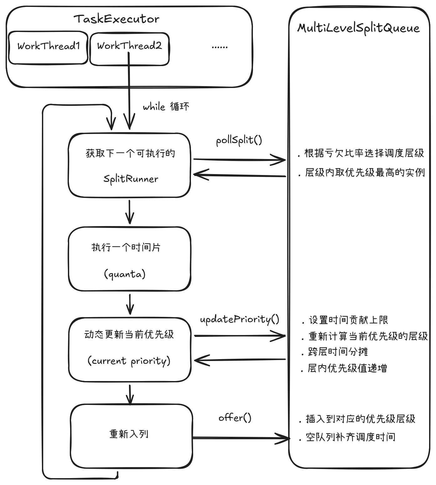

# Presto 查询引擎内核详解：基于多级反馈队列思想的 Worker 调度模型

#### 从操作系统调度思想到交互式查询执行调度

---

## 一、概述与设计背景

在 Presto Worker 的执行模型中，一个 Stage 的 PlanFragment 被发送到 Worker 节点后，会首先根据物理执行策略转换为本地可执行计划，并进一步切分为多个 Pipeline。
每个 Pipeline 由一组可以流水线执行的物理 Operator 构成。

随后，Pipeline 会根据执行策略实例化为多个 Driver。每个 Driver 代表一条独立的数据处理流水线，最终会被封装为 DriverSplitRunner，并进一步包装为
PrioritizedSplitRunner，作为 Worker Runtime 中可调度的执行实体。（关于 Pipeline、Driver 以及 SplitRunner 的概念以及生成和执行的过程，可以参考另一篇
文章《Presto 查询引擎内核详解：Worker 本地执行模型——从物理计划到可调度执行单元》。）

因此，在 Worker 本地执行阶段，Presto 面临的一个核心问题是：

> 当多个 Queries、Tasks 的 SplitRunners 同时处于可运行状态时，Worker 应该如何决定下一次 CPU 执行机会分配给哪个执行实体？

如果直接依赖操作系统线程调度器，调度粒度通常停留在线程层面，而操作系统并不了解查询引擎中的 Query、Task、Split 等语义关系。例如，一个大型扫描查询可能产生大量
SplitRunner，从线程调度角度看，它天然拥有更多 runnable 实体；但从用户视角看，这并不意味着该 Query 应该无限占用 Worker 的计算资源。

因此，分布式查询引擎需要在 Worker Runtime 层重新定义：

- 什么是公平的调度实体；
- 如何取舍短查询响应时间与长查询吞吐；
- 如何避免大查询长期占用执行资源；
- 如何保证不同查询之间的执行机会。

这也是 Presto 引入 MultiLevelSplitQueue 的原因。

### 1.1 MultiLevelSplitQueue 设计思想

MultiLevelSplitQueue 是 Presto Worker 端用于管理 PrioritizedSplitRunner 执行机会分配的核心调度组件。它借鉴了操作系统多级反馈队列
（Multi-Level Feedback Queue, MLFQ）的动态优先级思想，但并不是简单复用操作系统调度算法，而是针对交互式 SQL 查询场景进行了重新设计。

其核心思想是：

> 通过动态优先级调整机制，使不同执行时间特征的 SplitRunner 获得合理的 Worker 执行机会；同时，通过 TaskPriorityTracker 将调度执行实体与公平语义实体解耦，
> 使 Worker 调度能够感知 Task 或 Query 级别的公平策略，而不是简单地对每一个 SplitRunner 独立调度。

在 Presto 的设计中：

```
执行时间较短 --> 较高调度优先级 --> 更容易获得 Worker 执行机会
执行时间较长 --> 较低调度优先级 --> 降低获得 Worker 执行的机会，但不会永久饥饿
```

这种机制更加适用于交互式查询场景，因为不同查询的执行时间差异非常明显：

- 带谓词下推的扫描、简单聚合等短查询可能只需要几十毫秒；
- 大规模扫描、复杂 Join 查询可能持续数分钟甚至更久。

如果采用简单的 FIFO 调度，先进入 Worker 的长时间运行查询可能持续占用执行机会，导致后续到达的短查询产生较高的排队延迟。

而如果采用简单的优先级队列，低优先级查询可能由于长期无法获得执行机会而产生饥饿问题，同样导致调度公平性下降。

因此，一个合格的交互式查询引擎的 Worker 调度策略需要同时满足：

- 短查询低延迟；
- 长查询持续推进；
- 不同查询之间相对公平；
- 避免执行实体长期饥饿。

### 1.2 MultiLevelSplitQueue 的设计目标

| 目标 | 说明 |
| :--- | :--- |
| 低延迟响应（Responsiveness） | 保证短生命周期查询能够快速获得执行机会，避免被长时间运行任务拖慢 |
| 公平调度（Fairness） | 根据配置的公平粒度（Task 或 Query）共享调度状态，使执行机会更加符合查询语义 |
| 执行隔离（Execution Isolation） | 避免单个大型查询通过大量 SplitRunners 持续占用 Worker 执行资源 |
| 动态调整（Adaptiveness） | 根据执行历史动态调整调度优先级，而不是采用固定优先级 |
| 抗饥饿（Starvation Prevention） | 确保长时间运行任务仍能够周期性获得执行机会，不会永久等待 |

需要注意的是，MultiLevelSplitQueue 解决的是 Worker 内部执行机会分配问题，而 Query 级别的资源配额、资源组隔离以及集群级调度，则由 Presto 上层资源管理机制负责。

## 二、核心数据结构

### 2.1 动态优先级分层模型

MultiLevelSplitQueue 并不是为 SplitRunner 分配固定优先级，而是根据其累计执行行为动态映射到不同调度层级。

其核心目标：

- 新进入或短时间运行的执行实体优先获得CPU机会；
- 长时间运行实体逐渐降低调度频率；
- 通过层级迁移避免长任务永久占用高优先级资源。

```
// 每一层对应的累积调度时间阈值（秒）
private static final int[] LEVEL_THRESHOLD_SECONDS = {0, 1, 10, 60, 300};
```

系统根据 SplitRunner 的累计调度时间，将其映射到5个优先级层次中。

| Level | 累计调度时间范围 | 调度倾向 |
| :---: | :--- | :--- |
| 0 | <1s | 优先响应短任务 |
| 1 | 1s~10s | 保持较高调度频率 |
| 2 | 10s~60s | 正常调度 |
| 3 | 60s~300s | 降低连续执行机会 |
| 4 | >300s | 限制长期占用，但持续提供执行机会 |

整体思路是：累计调度时间越少，意味着消耗CPU资源越少，因此应该给予更多调度机会。

### 2.2 TaskPriorityTracker：公平调度语义抽象

需要说明的是：MultiLevelSplitQueue 在 Worker 本地调度层面提供 SplitRunner 的公平调度，而公平粒度由 TaskPriorityTracker 决定，可以配置为 Task 级公平
（TASK_FAIR）或 Query 级公平（QUERY_FAIR）。

TaskPriorityTracker 不直接参与执行，而用于维护多个 SplitRunner 共享的调度状态。

根据配置：

- TASK_FAIR：多个 SplitRunner 共享 Task 级调度状态；
- QUERY_FAIR：多个 Task 下的 SplitRunner 共享 Query 级调度状态。

它使得：实际调度对象（PrioritizedSplitRunner）与公平竞争对象（Task / Query）二者解耦，如下图所示：

```
 SplitRunner SplitRunner ...
     |          |
     | 关联      | 关联
     v          v
   TaskPriorityTracker
            |
    +----------------+
    |                |
TASK_FAIR        QUERY_FAIR
    |                |
Task级共享        Query级共享
priority          priority
```

TaskPriorityTracker 并不改变 SplitRunner 作为实际执行实体的角色，而是为多个 SplitRunner 提供共享的公平状态，使调度算法能够在不同公平粒度之间复用。

### 2.3 Priority 优先级表示

Priority 并不应该被简单理解为描述某一个 SplitRunner 固定优先级的静态标签，而是 TaskPriorityTracker 维护的动态公平调度状态在 Worker 调度层面的表现形式。

```
class Priority {
    int level;          // 所在层次 0-4
    long levelPriority; // 层内优先级（值越小优先级越高）
}
```

Priority 实际上包含两个维度：

```
          Priority
             |
    +--------+--------+
    |                 |
  level        levelPriority
 层级选择           层内排序
```

其中：

- level 代表了该 Priority 对应的调度实体及其对应的共享公平状态当前处于哪一个层级中；
- 而 levelPriority 则反映了该状态在当前层级中的相对调度优先级，其值基于累计调度时间计算。通常情况下，执行时间越长，levelPriority 越大，表示该执行实体已经消耗更多 Worker 执行资源，因此后续调度机会相对降低。

### 2.4 核心属性说明

```
// 每层的等待队列（优先级队列）
List<PriorityQueue<PrioritizedSplitRunner>> levelWaitingSplits;

// 每层的累积调度时间（纳秒）
final AtomicLong[] levelScheduledTime;

// 每层的最小优先级（防止任务饥饿）
final AtomicLong[] levelMinPriority;

// 调度计数器（记录每层被选中的次数）
List<CounterStat> selectedLevelCounters;
```

各属性的作用：

- levelWaitingSplits：维护每个调度层级中的待执行 SplitRunner。同一层内部通过 Priority 排序决定调度顺序，而整体的公平性由共享的调度状态和优先级计算机制共同保证。
- levelScheduledTime：是 MultiLevelSplitQueue 实现动态公平调度的核心状态，它反映每个层级已经获得的执行资源，并参与下一轮调度比例计算。
- levelMinPriority：该层当前的最小优先级门槛，用于限制同一层级中新加入 SplitRunner 的初始优先级，避免新任务凭借较低优先级值持续插入已有任务之前，从而破坏层内调度公平性。
- selectedLevelCounters：统计每层被选中的次数，用于监控和问题诊断。

## 三、MultiLevelSplitQueue 如何实现动态公平调度

在 Presto Worker 节点启动时，其 TaskExecutor 核心调度器会启动固定数量（maxWorkerThreads，默认为 CPU核心数 * 2）的常驻TaskRunner工作线程。每一个工作线程会
循环调用 MultiLevelSplitQueue.take()，根据多级优先级算法获取下一个要执行的 PrioritizedSplitRunner，流程如下图所示：

<div align="center">
  
</div>

### 3.1 层级选择策略：pollSplit()

这是整个调度器最核心的方法。算法的核心思想是：首先选择最"亏欠"的层级（目标调度时间与实际调度时间比率最高的层级），然后在该层中取出优先级最高的 Split。

```
private PrioritizedSplitRunner pollSplit() {
    // Step 1: 计算 Level 0 的目标调度时间
    long targetScheduledTime = getLevel0TargetTime();
    double worstRatio = 1;
    int selectedLevel = -1;

    // Step 2: 遍历所有层级，计算亏欠比率
    for (int level = 0; level < LEVEL_COUNT; level++) {
        if (!levelWaitingSplits.get(level).isEmpty()) {
            long levelTime = levelScheduledTime[level].get();
            // 比率 = 目标时间 / 实际时间
            double ratio = levelTime == 0 ? 0 :
                           targetScheduledTime / (1.0 * levelTime);
            if (selectedLevel == -1 || ratio > worstRatio) {
                worstRatio = ratio;
                selectedLevel = level;
            }
        }
        // 进入下一层时目标时间递减（乘以 levelTimeMultiplier 的倒数）
        targetScheduledTime /= levelTimeMultiplier;
    }

    // Step 3: 从选中的层级中取出优先级最高的 Split
    return selectedLevel == -1 ? null :
           levelWaitingSplits.get(selectedLevel).poll();
}
```

需要注意的是，这里的层级（Level）并不是固定优先级，而是一种基于历史执行结果的反馈调度。最终选择结果取决于各层实际获得资源与目标资源之间的偏差。

算法关键点：

- 目标时间逐层递减：通过 levelTimeMultiplier（默认 2）缩放，值越大表示更高层级的执行实体被分配到的目标时间越少。
- 亏欠比率计算：ratio = target / actual，比率越大表示该层越被"亏欠"。
- 选择策略：选 ratio 最大的层级，确保长期运行的低优先级层级不会因为历史资源消耗而永久失去执行机会。
- 层内公平：从选中层级的 PriorityQueue 中选择 levelPriority 最小的 SplitRunner，即优先选择在当前层级中累计调度时间较少的执行实体。

### 3.2 统一时间尺度：不同优先级层级如何进行公平比较

```
private long getLevel0TargetTime() {
    long target = 0;
    for (int level = 0; level < LEVEL_COUNT; level++) {
        long time = levelScheduledTime[level].get();
        // 折算到 Level 0 的目标时间：实际时间 × 乘数^level
        long levelTarget = (long) (time * Math.pow(levelTimeMultiplier, level));
        target = Math.max(target, levelTarget);
    }
    return target;
}
```

设计意图：

- 所有层级以 Level 0 为统一基准进行比较
- 高层级的实际调度时间贡献被放大（乘以 M^level），保证其不会因绝对值小而被忽略
- 取最大值确保所有层级的目标至少达到当前最高折算值

直观理解：

> level0TargetTime 表示"将不同层级执行时间统一折算到 Level 0 后，当前消耗最大的那一层所对应的值"，用于比较各层调度状态的基准值。公式为：

```
level0TargetTime = max(L0, L1×M, L2×M², L3×M³, L4×M⁴)
```

### 3.3 空队列补偿：offer()

问题：如果某层长期为空，levelScheduledTime 停止增长。一旦新任务到来，ratio = target / 0 → ∞，该层将疯狂抢占资源，导致其他层级饥饿。

解决方案：任务入队时，若目标层为空，人为"补齐"调度时间：

```
if (levelWaitingSplits.get(level).isEmpty()) {
    long level0Time = getLevel0TargetTime();
    long levelExpectedTime = (long) (level0Time / Math.pow(levelTimeMultiplier, level));
    long delta = levelExpectedTime - levelScheduledTime[level].get();
    levelScheduledTime[level].addAndGet(delta);
}
```

空队列补偿机制避免调度器仅依据当前瞬时状态做决策，而是保持历史公平状态连续。本质上，该机制是一种公平状态校准机制，它避免某一层级因为长期无任务而积累错误的调度偏差。

### 3.4 优先级更新策略：updatePriority()

每次 Split 执行完一个时间片后调用，决定其是否迁移到新的优先级层级：

```
public Priority updatePriority(Priority oldPriority,
                               long quantaNanos,
                               long scheduledNanos) {
    int oldLevel = oldPriority.getLevel();
    int newLevel = computeLevel(scheduledNanos);

    // 单次时间贡献上限（防止异常任务污染）
    long levelContribution = Math.min(quantaNanos, LEVEL_CONTRIBUTION_CAP);

    if (oldLevel == newLevel) {
        // 同层：累加调度时间，层内优先级增加
        addLevelTime(oldLevel, levelContribution);
        return new Priority(oldLevel,
                           oldPriority.getLevelPriority() + quantaNanos);
    } else {
        // 跨层：在路径上所有层分配时间
        distributeTimeAcrossLevels(oldLevel, newLevel, levelContribution);
        // 获取新层的最小优先级
        long minPriority = getLevelMinPriority(newLevel, scheduledNanos);
        return new Priority(newLevel, minPriority + quantaNanos);
    }
}
```

关键设计决策：

- 时间贡献上限：LEVEL_CONTRIBUTION_CAP = 30秒，防止异常慢任务一次贡献过多时间扭曲层级统计。
- 跨层时间分摊：假设一个 Split 一次运行了 350 秒，直接从 Level 0 跳到 Level 4。如果将所有时间都记在 Level 4，会导致该层统计爆炸。正确做法是模拟逐级晋升，将时间分摊到经过的每一层：

```
假设本次 Split 执行的时间贡献为： lc = Math.min(quantaNanos, LEVEL_CONTRIBUTION_CAP)

Level 0   ----→  Level 1   ----→  Level 2   ----→  Level 3   ----→  Level 4
min(1s, lc)      min(9s, lc)      min(50s, lc)     min(240s, lc)    (剩余 lc)
```

- 层内优先级值递增：每轮调度后 levelPriority 增加 quantaNanos。由于该值越小表示优先级越高，因此执行时间越长的执行实体，其在同层PriorityQueue中的相对排序逐渐靠后。

### 3.5 调度过程示例

为了直观理解 MultiLevelSplitQueue 的调度行为，考虑 Worker 节点同时运行两个 Query：

- Query A：大规模扫描查询
    - 产生大量 SplitRunner；
    - 执行时间较长，持续占用 Worker 资源。
- Query B：交互式短查询
    - SplitRunner 数量较少；
    - 希望快速完成并返回结果。

假设 Worker 采用 QUERY_FAIR 调度策略，则同一个 Query 下的 SplitRunner 共享 Query 级 TaskPriorityTracker。

#### 阶段一：长查询持续运行

Query A 首先进入 Worker 执行。

由于其 SplitRunner 初始累计执行时间较少，因此刚开始执行时处于：Level 0。

随着执行时间增加，其 Priority 状态逐渐迁移：

```
Level 0 --> Level 1 --> Level 2 --> Level 3
```

Query A 并不会因为运行时间增长而被停止执行，而是通过降低调度优先级，减少连续占用 Worker 的机会。

#### 阶段二：短查询加入

此时 Query B 到达 Worker。

由于 Query B 刚开始执行，其 SplitRunner 位于较低 Level：

```
Level 0:
    Query B（累计执行时间较少）

Level 3:
    Query A（累计执行时间较长）
````

MultiLevelSplitQueue 并不会简单按照 Level 高低或者 SplitRunner 数量决定调度顺序，而是根据各层实际获得的执行时间与目标调度时间之间的比例进行动态调整。

同时，由于 levelTimeMultiplier 的存在，高 Level 的实际执行时间会被折算放大，因此长期运行任务消耗的执行资源会更快反映到调度状态中。如此一来，在相同的实际执行
时间下，Level 0 会倍判定为“更加亏欠”，从而其中的任务会获得更高概率的调用机会。

因此，调度器能够在保证 Query A 持续推进的同时，给予 Query B 更加充足的执行机会。

#### 阶段三：短查询完成，长查询继续推进

Query B 由于执行逻辑简单，很快完成。随后 Worker 就会继续从 MultiLevelSplitQueue 中选择 Query A 的 SplitRunner 执行。

Query A 虽然处于较低 Level，但仍然可以通过层级间的公平调度获得执行机会，持续推进直到完成。

#### 调度效果

通过上述过程可以看到，MultiLevelSplitQueue 并不是简单地优先执行短任务，也不是固定保证某个查询优先级，而是通过动态反馈机制实现：

```
短查询:
短查询由于累计执行时间较少，通常处于较低Level，从而更容易获得执行机会。

长查询:
随着资源消耗降低调度频率，但持续获得执行机会

多个Query:
基于Task/Query级公平状态共享执行资源
```

因此，MultiLevelSplitQueue 本质上是在 Worker Runtime 层将查询语义引入 CPU 调度过程，使执行机会分配不再依赖线程数量或 Split 数量，而能够感知 Query / Task 级别的公平性。

## 四、阻塞恢复场景下的公平性维护

### 4.1 层级优先级基准维护：levelMinPriority

levelMinPriority 用于记录每个调度层级当前已经推进到的优先级基准，其作用为：

- 防止重新进入某层的 SplitRunner 因携带过旧的 levelPriority 值，在当前层级竞争中获得非预期优势。
- 避免长时间阻塞后恢复的任务立即连续抢占同层其他任务的执行机会。

当一个任务首次进入到一个之前为空的层级时（其默认 levelMinPriority[level] 值为 -1），记录当前任务的调度时间作为基准：

```java
public long getLevelMinPriority(int level, long taskThreadUsageNanos) {
    levelMinPriority[level].compareAndSet(-1, taskThreadUsageNanos);
    return levelMinPriority[level].get();
}
```

此外，每次成功调度一个 SplitRunner 后，MultiLevelSplitQueue 会使用该 SplitRunner 的 levelPriority 更新对应层级的基准值，使其随着调度过程不断前移。

```
int selectedLevel = result.getPriority().getLevel();
levelMinPriority[selectedLevel].set(result.getPriority().getLevelPriority());
```

## 4.2 Blocked SplitRunner 恢复后的优先级重置

当 SplitRunner 因为 IO、网络或者其他原因进入 Blocked 状态时，其并不会继续消耗 Worker CPU 时间。因此，当它重新恢复 Runnable 状态时，原有的 levelPriority 可能已经不能完全反映当前层级中的公平竞争关系。

因此，Presto 在重新入队前会重新校准其层内优先级：

```
public synchronized Priority resetLevelPriority() {
    long minPriority = splitQueue.getLevelMinPriority(
        priority.getLevel(), scheduledNanos);
    if (priority.getLevelPriority() < minPriority) {
        // 将优先级提升到对应层次的基准优先级
        return new Priority(priority.getLevel(), minPriority);
    }
    return priority;
}
```

如果发现当前 SplitRunner 的 levelPriority 已落后于该层级调度基准，则将其提升到当前层级进度。

设计考虑：

- 阻塞数分钟的任务被唤醒后，不会因为使用原始优先级（过小的 levelPriority 值）而连续插入到同层队列前部，降低其他任务获得执行机会的公平性
- 通过将优先级提升到层级最小值，保证了同层内调度的公平性
- 调用时机：Split 从阻塞状态恢复、重新入队之前

通过 levelMinPriority 和 resetLevelPriority，MultiLevelSplitQueue 保证了调度公平状态在 Runnable → Blocked → Runnable 生命周期转换过程中保持连续，避免历史执行状态导致新的不公平。

## 五、总结：MultiLevelSplitQueue 的设计取舍

### 5.1 本质定位

MultiLevelSplitQueue 并不是一个简单的优先级队列，而是一个面向 Worker 本地执行场景的多级公平调度器。

其核心设计融合了：

- MLFQ-like 分层反馈机制：根据 SplitRunner 执行历史动态调整调度优先级；
- 加权公平调度思想：通过目标调度比例控制不同层级之间的资源分配；
- 时间分摊机制：限制单个任务对调度状态的影响；
- 补偿与校准机制：通过优先级更新和阻塞恢复处理避免长期不公平；
- 执行实体与公平语义实体分离：以 SplitRunner 作为实际调度执行单位，同时通过更高层级语义实体保证资源公平。

### 5.2 为什么选择 MLFQ-like 调度模型

调度算法不存在绝对优劣，关键在于是否匹配 workload 特征。

操作系统调度器通常面向长期运行进程，其 CPU 时间公平性能更好地兼顾交互响应（交互进程长期处于阻塞等待，一旦被唤醒就处于严重亏欠状态，因此会被优先调度）；而 Presto 面向
的是持续 runnable 的查询执行任务，其更关注查询完成延迟以及多查询竞争下的尾延迟，完全公平调度策略（例如 CFS）对其尽快满足短查询的倾向无法提供太大的帮助。

因此，Presto 并未采用追求长期 CPU 公平的通用调度模型，而选择了更加适合 Interactive SQL 场景的 MLFQ-like 策略：

- 短查询可以快速获得执行机会；
- 长查询随着运行时间增加逐渐降低优先级；
- 长任务不会因为低优先级而完全停止推进。

这种设计目标是在响应性和公平性之间取得平衡，而不是追求某一种通用意义上的最优调度。

对于更加偏向批处理的大规模计算场景，则可以通过其他执行模式（例如POS）进行扩展。

### 5.3 核心思想总结

Presto 的 MultiLevelSplitQueue 设计体现了以下思想：

| 思想 | 说明 |
| :--- | :--- |
| 分层反馈 | 根据执行历史动态调整调度优先级 |
| 公平与效率平衡 | 在避免任务饥饿的同时优化短查询响应 |
| 鲁棒性设计 | 通过多种校准机制处理异常执行状态 |
| 自适应调度 | 根据实际运行行为动态调整调度策略 |
| 场景驱动 | 针对 Interactive SQL workload 进行优化 |

最终，MultiLevelSplitQueue 体现的是一种场景驱动的调度设计：

> 调度策略服务于计算模型，而非让计算模型迁就某种所谓更优的调度算法。成熟的系统设计往往不会追求使用单一调度模型覆盖所有场景，而是在明确 workload 特征和系统目标后，
选择与计算模型匹配的调度策略。


---

## 欢迎交流

本文基于作者当前的理解与实践经验整理而成，难免存在疏漏或值得进一步探讨之处。

如果您对文中的观点有不同看法，发现任何问题，或有相关实践经验，欢迎通过 [GitHub Issue](https://github.com/hantangwangd/hantangwangd.github.io/issues/new) 与作者交流讨论。

期待与更多同行围绕数据基础设施相关技术展开交流，分享实践经验，共同学习、共同进步。
