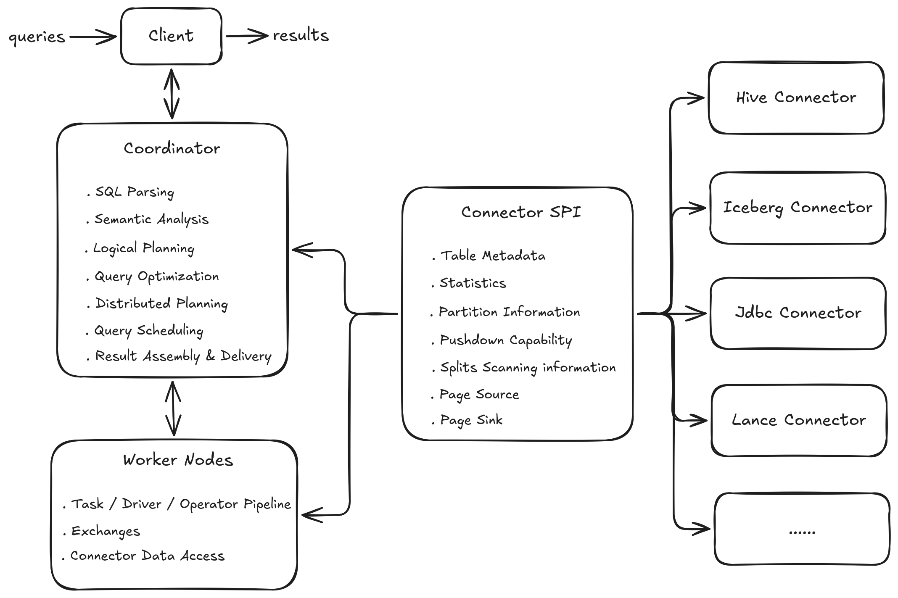
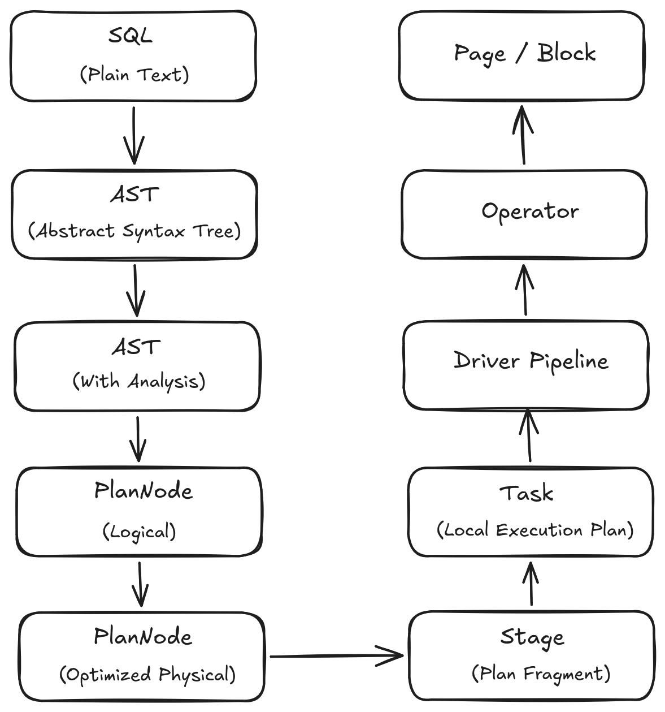
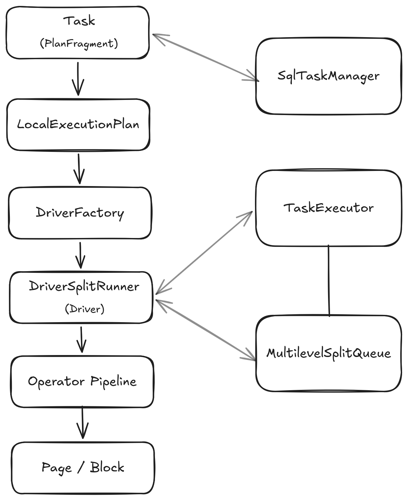

# Presto 查询引擎内核详解：整体架构与查询执行流程

## 一、Presto 查询引擎整体架构

Presto 是一个面向交互式分析场景设计的分布式 SQL 查询引擎。它的核心目标是将用户提交的 SQL 查询转换为分布式执行计划，并通过 Coordinator 进行任务调度，最终驱动 Worker 节点上的算子流水线执行。

从查询执行架构来看，Presto 可以划分为三个核心部分：

<div align="center">
  
</div>

其中：

- Coordinator 负责查询生命周期管理、逻辑优化以及分布式调度；
- Worker 负责具体的数据计算与执行流水线运行；
- Connector SPI 负责连接计算引擎与外部数据源，一方面向 Coordinator 提供元数据描述和数据源能力信息，支持谓词下推、聚合下推、分区裁剪、基于统计信息的优化等查询优化能力；另一方面向 Worker 提供 PageSource、PageSink 等数据读写接口，完成实际的数据访问。

查询执行过程围绕 Query、Stage、Task、Driver、Operator 等执行对象展开，而 Connector SPI 则实现了计算引擎与底层存储系统之间的解耦。

理解这些对象之间的关系，是理解 Presto 内核实现的基础。

## 二、一条 SQL 在 Presto 中的完整生命周期

一条 SQL 从提交到最终返回结果，需要经历多个抽象层次转换：

<div align="center">
  
</div>

Presto 并不是直接执行 SQL，而是逐层将用户表达转换为可执行模型。

### 2.1 查询准入与资源管理

提交查询后，Presto 首先通过 Resource Group 对查询进行分类和管理。

Resource Group 根据：

- 用户；
- 查询标签；
- 用户组；
- 查询特征；

将查询映射到对应资源组，并实施：

- 并发限制；
- CPU资源限制；
- 内存限制；
- 排队策略。

它是 Coordinator 层面保证多租户环境稳定运行的重要机制。

### 2.2 Connector SPI：连接查询优化与数据访问

Presto 通过 Connector SPI 实现计算引擎与外部数据源之间的解耦。Connector 并不仅仅负责 Worker 阶段的数据读取，而是贯穿查询规划、优化以及执行全过程。

在 Planning 和 Optimization 阶段，Coordinator 会通过 Connector 获取外部数据源提供的元信息和能力描述，包括：

- Schema 信息；
- Table / Column Metadata；
- Partition 信息；
- Statistics；
- Connector 支持的 Pushdown 能力。

这些信息会参与：

- 表结构解析；
- 查询优化；
- Predicate Pushdown；
- Projection Pushdown；
- Aggregation Pushdown；
- Partition Pruning；
- 基于统计信息的成本优化。

在执行阶段，Worker 根据 Coordinator 生成的执行计划，通过 Connector 创建具体的数据访问对象：

```
TableScan Operator --> Connector PageSource --> External Storage
```

Connector 负责将外部数据转换为 Presto 内部统一的数据表示：

```
External Data --> Connector --> Page/Block --> Operator Pipeline
```

同时，在写入场景下，Connector 通过 PageSink 接收执行结果，并完成目标系统的数据写入。

## 三、SQL解析与语义分析：从 SQL 文本到语义绑定模型

### 3.1 Statement：SQL 的抽象语法树

用户提交的 SQL 首先经过 Parser 解析。Parser 基于 ANTLR 完成 SQL 文法解析，并通过 AstBuilder 将解析结果转换为 Presto 内部的 AST Node 层次结构 Statement。

Statement 是 SQL 顶层语法结构的抽象表示，不同 SQL 类型对应不同 Statement 子类，包括 Query、Insert、CreateTable 等。例如，对于查询语句来说，其内部包含的属性有：

- 查询主体 Query；
- SELECT 列表；
- FROM 子句；
- WHERE 条件；
- GROUP BY；
- ORDER BY；
- LIMIT。

对于包含子查询的 SQL，Statement 本身也是递归结构。例如：

```
SELECT *
FROM (
    SELECT id
    FROM table_a
)
```

内部会形成多层 Query 结构。

### 3.2 Analysis：完成语义绑定

Parser 只能理解 SQL 结构，而无法判断：

- 表是否存在；
- 字面量的列名到底指向的是哪个表的哪个列；
- 数据类型是否匹配；
- 函数是否有效。

因此 Presto 需要 Analyzer 对 AST 进行语义分析。并使用 Analysis 保存语义分析结果，例如：

- 表和列的绑定关系；
- 类型推导结果；
- 表达式解析信息。

Analyzer 基于 Visitor 模式自顶向下遍历 AST，并在分析过程中逐步构建语义上下文。这一阶段完成了从“SQL语法”到“SQL语义”的转换。

## 四、逻辑计划生成与优化：从 SQL 到执行策略

### 4.1 Logical Plan

经过 Analyzer 后，LogicalPlanner 根据 Analysis 中的语义信息将 Statement 转换为逻辑计划 Plan。

Plan 本质上是一棵由 PlanNode 组成的树：

```
        OutputNode
             |
       AggregationNode
             |
          JoinNode
          /      \
     ScanNode   ScanNode
```

每一个 PlanNode 描述一种逻辑操作：

- TableScanNode：读取数据；
- FilterNode：过滤；
- JoinNode：关联；
- AggregationNode：聚合；
- SortNode：排序。

PlanNode 是 Presto 内部统一的查询计划表示。LogicalPlanner 根据语义分析结果生成初始 PlanNode 树，Optimizer 在此基础上不断重写和增强计划，使其逐渐包含执行策略信息。

### 4.2 Optimizer：生成优化后的执行计划

Presto 在 Logical Plan 基础上执行一系列优化规则，将初始计划转换为更加高效的执行计划。优化过程包括：

- 谓词下推；
- 列裁剪；
- Join 类型选择；
- Join 顺序调整；
- 数据分布策略选择；
- Exchange 规划；
- Local Exchange 规划；
- 等等。

例如：

```
Logical Join
      |   Optimizer
      v
Broadcast Join
      or
Partitioned Join
```

优化后的 Plan 仍然保持统一的 PlanNode 树结构，但已经融合了更多执行相关的信息，包括数据分布方式、Join 策略以及后续执行阶段所需的物理属性。

需要注意的是，Presto 的优化体系并不是严格区分 Logical Optimization、Physical Planning 和 Cost Based Optimization 的单一阶段，而是在统一的 Plan 优化框架中
融合了多种优化能力：

- 基于规则的优化（Rule-based Optimization），例如谓词下推、列裁剪等；
- 基于成本的优化（Cost-based Optimization），例如 Join Reordering、Join Distribution Selection 等；
- 面向执行的物理规划能力（Physical Planning），例如 Exchange 和 Local Exchange 的生成。

最终，Optimizer 输出的是一个经过优化并包含执行策略信息的物理执行计划，后续将由 Distributed Planning 和 Scheduler 进一步转换为可调度执行的 Stage 和 Task。

## 五、从执行计划到分布式执行图

物理计划描述的是单个查询的计算逻辑，而分布式执行还需要进一步划分执行阶段。

### 5.1 Remote Exchange：Stage切分边界

Presto 根据 Remote Exchange 对执行计划进行切分，而 Local Exchange 仅用于单个 Worker 内部的数据重分布，不形成新的 Stage。

Remote Exchange 表示：数据需要跨 Worker 节点进行交换。因此：

```
Plan Tree
   |
Remote Exchange
   |
Stage Boundary
```

Remote Exchange 会形成 Stage 之间的数据交换边界，使 Exchange 两侧的计划片段分别属于不同 Stage。

### 5.2 Stage 与 PlanFragment

在分布式规划阶段，Presto 将执行计划切分为多个 SubPlan。每个 SubPlan 包含一个 PlanFragment，以及由 Remote Exchange 引出的子 SubPlan 依赖关系：

- PlanFragment；
- 子 SubPlan 列表。

PlanFragment 是分布式规划阶段生成的静态执行计划片段，描述单个 Stage 内的计算逻辑；运行时 Coordinator 基于 PlanFragment 创建对应 Stage，并负责调度执行。

运行时，Coordinator 根据这些 SubPlan 创建对应 Stage，并负责调度执行。在传统 Presto 执行模型中，Stage 通常形成树形依赖关系：

```
        Stage 0
          |
        Stage 1
        /    \
   Stage 2  Stage 3
```

这与 Spark 基于 Shuffle DAG 的执行模型不同。

Presto 更强调：

- 数据流式传递；
- Pipeline 执行；
- 减少中间结果物化。

需要说明的是：在传统流式执行模型中，Stage 通常按照 Exchange 形成的数据流依赖关系进行调度。但随着 Exchange Materialization 能力的引入，Presto 在保留
Pipeline Streaming 优势的同时，也具备了一定程度的阶段化物化执行能力。Section 用于组织相关 Stage 的执行依赖，使部分查询可以通过物化结果建立阶段边界，从而
提升大规模数据处理能力、执行稳定性以及容错能力。相比纯流式执行模式，该方式会引入额外的存储和 I/O 开销，但扩展了 Presto 能够支持的 workload 范围。

Stage 是分布式调度的基本单位，而真正下发到 Worker 执行的数据处理任务则会进一步通过 Split 进行划分。后续调度流程会围绕 Stage、Task、Split 之间的关系展开。

## 六、Coordinator 查询调度模型：从 Stage 到 Task 的分布式执行编排

生成 Stage 后，Coordinator 开始负责整个 query 的分布式调度。整体流程如下：

```text
Query
  |
SqlQueryScheduler
  |
SectionExecution
  |
StageScheduler
  |
RemoteTask
  |
Worker
```

### 6.1 Query级调度

SqlQueryScheduler 是查询级调度入口。 它负责：

- 管理 Section；
- 创建 StageExecution；
- 调度 Stage；
- 维护 Stage 之间的数据依赖。

Presto 会根据 Section 依赖关系选择当前可以执行的部分。调度时，SqlQueryScheduler 根据查询执行图创建 SectionExecution，并生成对应的 ExecutionSchedule。ExecutionSchedule 根据 Stage 依赖关系决定当前可调度的 Stage。

### 6.2 Section级调度

Section 是对 Stage 调度的一层组织抽象，其主要作用包括：

- 将具有流式 Exchange 依赖关系的 Stages 组织在同一个 Section 内，以支持 Pipeline Streaming 执行；
- 根据 Exchange Materialization 等阶段化执行依赖，将部分 Stages 划分到不同 Section 中；
- Section 之间通过依赖关系控制执行顺序，使 Presto 能够在流式执行和物化执行混合场景下，更好地支持大规模查询执行、失败恢复以及 Runtime CBO 等运行时优化能力。

Section 内部可以包含多个 Stage。一个 Section 在调度其内部包含的 Stage 时，可以有不同的调度策略：

#### AllAtOnceExecutionSchedule

一次调度 Section 内全部 Stage。

#### PhasedExecutionSchedule

将 Stage 划分多个 phase 按顺序进行调度以控制资源使用：

```text
Phase 1 --> Phase 2 --> Phase 3
```

这两种策略分别对应一次性调度和分阶段调度。

### 6.3 Stage调度

StageScheduler 是具体 Stage 的调度实现。

它负责：

- 创建 Task；
- 选择 Worker 节点；
- 消费 SplitSource，并分配 Split。

不同 Stage 类型会对应不同 Scheduler：

- SourcePartitionedScheduler；
- FixedCountScheduler；
- FixedSourcePartitionedScheduler；
- ScaledWriterScheduler。

Presto 根据 Stage 类型和数据分布策略选择不同 StageScheduler 实现，这些不同的实现类型采用不同的策略和逻辑来决定如何创建任务以及分配资源。

## 七、Worker 执行模型：Task、Driver 与 Pipeline Execution

Coordinator 完成 Task 调度后，Worker 开始实际执行任务。

Worker 内部执行层次如下所示：

<div align="center">
  
</div>

### 7.1 Task

Task 是 Worker 上执行某个 Stage 对应 PlanFragment 的基本实体。

在实际调度运行的过程中，Coordinator 根据 Stage 的调度策略选择 Worker 节点，并通过 RemoteTask 代理管理 Worker 上对应 Task 的生命周期。

### 7.2 LocalExecutionPlan

Worker 接收到 PlanFragment 后，会转换成本地执行计划 LocalExecutionPlan，其中包含：

- DriverFactory；
- OperatorFactory。

在分布式规划阶段，PlanFragment 描述的是一个 Stage 内的整体计算逻辑；而到了 Worker 执行阶段，该计划会进一步转换为一个或多个本地执行 Pipeline。

每个 Pipeline 由一组按照数据流连接的 Operator 组成，并最终由 Driver 负责驱动执行。

此外，在 Pipeline 执行模型中的另一个重要概念是 Lifespan。Lifespan 是 Presto 实现数据‘分组’（Grouped Execution）执行的关键。它让同一个 Stage 中属于不同数据组
（例如Hive表的不同Bucket）的 Split，可以在同一个 Worker 节点上的不同 Driver 中并发执行。

```text
       Pipeline
          |
 +----------------+
 |                |
Lifespan A     Lifespan B
 |                |
Driver(s)       Driver(s)
```

综上所述：

- PlanFragment 描述分布式执行阶段中的计算逻辑；
- LocalExecutionPlan 描述 Worker 内部如何组织这些计算逻辑；
- Pipeline 描述 Worker 内部的数据处理流水线，在 LocalExecutionPlan 中通过 DriverFactory 来表达；
- Driver 表示一个 Pipeline 在特定 Lifespan 下的一次执行实例。

LocalExecutionPlan 通过 DriverFactory 创建 Driver，并通过 OperatorFactory 创建具体 Operator，从而将逻辑计划转换为 Worker 可执行的数据处理流水线。

### 7.3 Driver：Pipeline 执行实例核心对象

Driver 是 Presto Worker 中表示一次 Operator Pipeline 执行实例的核心对象。如上所述，其结合了 Pipeline（算子链执行逻辑）和 Lifespan （数据分组）两个维度。

Driver 本身不是线程，也不与固定线程绑定，而是一个轻量级的执行流水线实例。它负责按照 Operator Pipeline 的定义持续处理 Page，并驱动各个 Operator 完成数据计算。

例如：

```
TableScanOperator --> FilterOperator --> ProjectOperator --> OutputOperator
```

Driver 按照 Pipeline 定义的 Operator 顺序持续处理数据流 Pages。

需要注意的是，Driver 并不是 Worker 调度系统直接管理的最小调度单元。为了支持优先级调度、时间片执行以及阻塞恢复，Presto 会将 Driver 封装为 DriverSplitRunner / PrioritizedSplitRunner，并交由 TaskExecutor 进行调度执行。

### 7.4 SplitRunner：Worker 调度层的最小执行单元

Presto Worker 并不是直接调度 Driver，而是将 Driver 封装为 SplitRunner。

核心关系：

```
TaskExecutor
    |  调度执行
    v
PrioritizedSplitRunner
        +-- DriverSplitRunner
                +-- Driver
```

其中：

- Driver 表示一个结合了 Pipeline（算子链执行逻辑）和 Lifespan（数据分组）两个维度的执行流水线；
- SplitRunner 是对 Driver 的封装，用于代表一次具体执行；
- PrioritizedSplitRunner 进一步提供优先级和时间片调度能力。

一个 Pipeline 根据不同 Lifespan 可以产生多个 Driver / DriverSplitRunner。

从职责划分来看，Presto Worker 执行模型可以分为两个维度：

计算模型：

```
Pipeline -> Driver -> Operator -> Page
```

调度模型：

```
TaskExecutor
    |
    v
SplitRunner -> Driver 执行
```

这种计算与调度分离的设计，使 Presto 能够在 Worker 内部实现细粒度资源分配与基于语义的公平调度，而不是将线程直接绑定到查询任务上。

## 八、数据流执行模型：Split、Page、Exchange

### 8.1 Split：数据调度单元

Split 是 Connector 根据外部数据源特征生成的可调度数据处理单元，是连接数据源访问和 Worker 执行的桥梁。 例如：

- Hive Connector 根据文件生成 Split；
- Iceberg Connector 根据数据文件生成 Split。

Split 本身并不包含实际数据，而是描述如何访问一部分数据的信息。

Coordinator 在查询规划阶段通过 Connector SPI 创建对应的数据源 SplitSource，并在调度阶段由 StageScheduler 获取 Split，并将其分配给 Worker Task。

### 8.2 Page：执行中的数据表示

Presto 内部采用基于 Page / Block 的列式批量数据处理模型。Page 是 Operator 之间传递的数据批次。一个 Page 由多个 Block 组成：

```
          Page

   +------+------+------+
   |      |      |      |
 Block0 Block1 Block2  ...

 Column0 Column1 Column2 ...
```

其中：

- Page 表示一批数据；
- Block 表示单个列的数据存储结构。

这种列式数据表示方式使 Operator 可以高效进行向量化计算，提高 CPU Cache 利用率，并减少数据复制开销。

同时，基于列式数据表示，Presto 可以更高效地配合查询优化阶段的列裁剪（Projection Pruning）和 Connector 层的列投影下推，仅生成和处理查询所需的数据列，从而降低
数据处理开销。

### 8.3 Exchange：Worker之间的数据传输

当查询涉及多个 Stage 时，不同 Worker 之间需要交换中间结果。

例如：

```
Worker A
   |
Remote Exchange
   |
Worker B
```

实际运行时：

```
Source Task
    |
OutputBuffer
    |
ExchangeClient
    |
Destination Task
```

其中：

- 上游 Task 将结果写入 OutputBuffer；
- 下游 Task 通过 ExchangeClient 拉取 Page；
- Page 继续进入后续 Operator Pipeline。

Presto 使用 ExchangeClient 接收远程 Task 输出的数据。ExchangeClient 负责管理来自多个上游 Task 的数据拉取，并将接收到的数据转换为 Page 流交给下游 Pipeline 继续处理。

需要注意的是，Remote Exchange 用于跨 Worker / Stage 的数据交换，而 Local Exchange 仅用于单个 Worker 内部的数据重新分布，不形成新的 Stage。

## 九、Presto 查询引擎的核心设计思想

通过上述各个章节的描述可以看到，Presto 的整体设计围绕几个核心思想展开。

### 9.1 分层抽象：从 SQL 语义到执行模型逐层映射

Presto 将查询处理过程拆分为多个抽象层次：

```text
SQL
 |
Statement / AST
 |
Analysis
 |
Logical Plan
 |
Optimized Physical Plan
 |
Stage / PlanFragment
 |
Task
 |
Driver Pipeline
 |
Operator
 |
Page
```

每一层承担不同职责：

- Analyzer 负责理解 SQL 语义；
- Planner / Optimizer 负责生成执行策略；
- Distributed Planner 负责形成分布式执行结构；
- Worker Runtime 负责高效执行数据计算。

这种分层设计使 SQL 语义、执行策略以及运行时实现相互解耦，是 Presto 能够持续演进 Connector、Optimizer 和 Execution Runtime 的基础。

### 9.2 Pipeline Streaming：面向低延迟分析的执行模型

Presto 面向交互式查询场景设计，其核心执行理念是 Pipeline Streaming。

与传统批处理系统依赖 Stage 边界进行大量中间结果物化不同，Presto 更倾向于：让数据持续流动。

这种设计带来的优势：

- 减少中间结果写入和读取；
- 降低端到端查询延迟；
- 提升交互式分析体验。

同时，Exchange Materialization 等能力的引入，使 Presto 在保持流式执行优势的同时，也逐渐具备阶段化物化执行能力，以支持更大规模、更复杂的 workload。

### 9.3 细粒度调度：计算实体与调度实体分离

Presto Worker 并不是直接以 Query 或 Task 作为调度单位，而是进一步拆分到 Driver/SplitRunner 层面。

其中：

- Driver 表示计算流水线实例；
- SplitRunner 表示可调度执行封装；
- TaskExecutor 负责多个执行实体之间的资源调度。

这种设计使计算逻辑和资源调度解耦，从而：

- 多查询共享 Worker 执行资源；
- 限制长查询对短查询的影响；
- 支撑交互式负载下的低延迟响应。

### 9.4 Connector SPI：计算与数据能力解耦

Presto 并不直接管理底层存储，而是通过 Connector SPI 将计算引擎与数据源能力解耦。

Connector 一方面向 Coordinator 提供：

- Metadata；
- Statistics；
- Pushdown 能力描述；
- Partition 信息。

另一方面向 Worker 提供：

- Split；
- PageSource；
- PageSink。

这种设计使 Presto 能够通过统一 SQL 接口访问不同数据系统，并将优化能力逐渐扩展到数据源侧。

> 总体来看，Presto 的设计并不是简单追求单点性能，而是在 SQL 抽象、分布式执行、资源调度以及数据源扩展性之间建立了一套高度解耦的执行体系，使其能够在交互式分析场景下提供低延迟、高扩展的数据查询能力。

## 十、后续系列文章规划

本文作为《Presto 查询引擎内核详解》的架构地图，后续将围绕查询生命周期深入分析各核心模块：

- SQL Analyzer：语义分析与符号解析体系

- Logical Planner：从 AST 到关系型执行计划的生成过程

- Optimizer：规则优化、成本优化与物理计划优化体系

- Physical Plan：Exchange规划与执行属性约束机制

- Distributed Execution：Stage切分、PlanFragment生成与分布式执行规划

- Query Scheduling：查询调度、Stage调度与Split分发机制

- Worker Execution Model：Task、Driver与Pipeline执行模型

- Worker 调度模型：基于多级反馈队列思想的执行实体调度机制

- Exchange机制：分布式数据交换与流式执行体系

- Memory Management：查询内存模型、内存池与资源控制机制

- Transaction Manager：事务管理与一致性控制

- Vectorized Execution：Page/Block模型与向量化执行优化

- 可撤回内存与 Spill 机制：Presto 查询执行的内存弹性机制

- Materialized View：基于增量维护和查询重写的物化视图体系

- Iceberg Connector：湖仓表格式集成、谓词下推、事务支持与元数据优化

- Presto 下一代执行引擎：Prestissimo 与 Velox 架构演进

- 待补充完善......

通过这些章节，可以逐步深入 Presto 从 SQL 输入到分布式执行完成的完整内部机制。


---

## 欢迎交流

本文基于作者当前的理解与实践经验整理而成，难免存在疏漏或值得进一步探讨之处。

如果您对文中的观点有不同看法，发现任何问题，或有相关实践经验，欢迎通过 [GitHub Issue](https://github.com/hantangwangd/hantangwangd.github.io/issues/new) 与作者交流讨论。

期待与更多同行围绕数据基础设施相关技术展开交流，分享实践经验，共同学习、共同进步。
