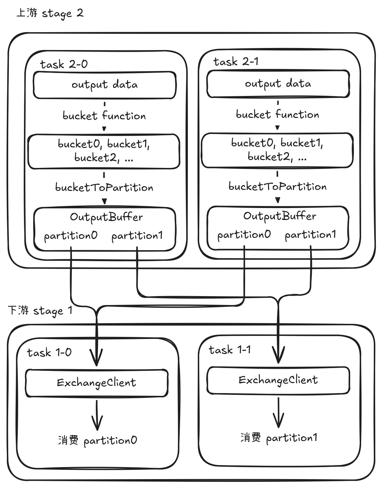
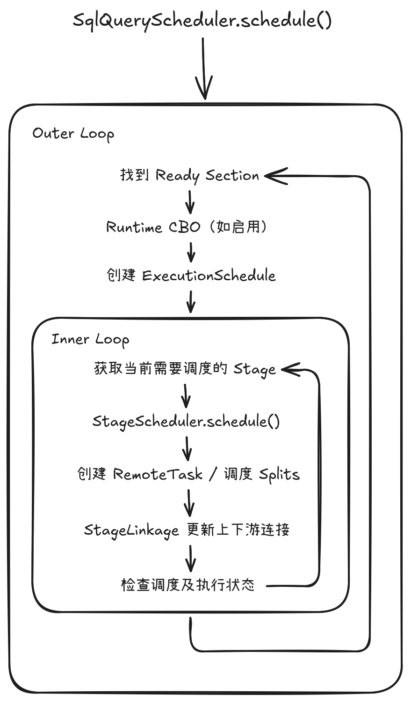

# Presto 查询引擎内核详解：分布式调度模型

#### 从 Distributed Plan 到 RemoteTask：SqlQueryScheduler 的构建与调度

---

## 引言：SqlQueryScheduler 到底负责什么？

在 Presto 的执行过程中，Planner (LogicalPlanner/Optimizer/PlanFragmenter) 最终生成的是一个 Distributed Plan，而真正把这个计划变成 Worker 上运行的 Task，则需要经过 Query Scheduler。

SqlQueryScheduler 是这个过程中的核心组件。从对象作用域来看，SqlQueryScheduler 是一个 Query 级别的调度对象：每个 Query 的执行过程都对应一个独立的 SqlQueryScheduler 实例，它负责维护和推进当前 Query 的 Section、Stage、Task 以及整体执行状态。

如果只从源码方法来看，SqlQueryScheduler 会涉及大量类和方法：StreamingPlanSection、StageExecution、StageScheduler、StageLinkage、RemoteTask、ScheduledSplit、OutputBuffer 等，很容易陷入“这个方法调用了那个方法”的细节，却很难建立整体认识。

实际上，可以把 SqlQueryScheduler 的职责概括成两件事情：

- 构建调度执行实体：将已经生成的 Distributed Plan 转换为可调度的 StageScheduler，并为 Stage 创建相应的 StageExecution 等运行时调度对象。
- 推进调度执行过程：不断调度 Stage、创建 RemoteTask、将 Splits 调度到 Task，并建立上下游 Stage 之间的数据流连接。

理解 SqlQueryScheduler 的关键，不是逐个理解这些类和方法，而是从“构建”和“调度”两个角度，理解它如何将 Distributed Plan 划分为若干 Section，并以 Section 为组织单位构建 Stage 和 Task 的调度实体，再通过持续推进调度状态驱动整个 Query 执行。

```
             Distributed Plan (SubPlan)
                       │  划分为 Section
                       ▼
             StreamingPlanSection
                       │  构建调度执行实体
                       ▼
              SqlQueryScheduler
                       ├── StageId1 -> StageExecutionAndScheduler 1
                       ├── StageId2 -> StageExecutionAndScheduler 2
                       └── ......             │
                                    ┌─────────┼─────────┐
                                    ▼         ▼         ▼
                         StageExecution StageScheduler StageLinkage
                                              │ stage 调度
                                              ▼
                                          RemoteTask
```

此外，要理解整个调度过程，还需要进一步关注 Stage 之间的运行时数据流关系：一个 Stage 的输出如何连接到下游 Stage，以及这种上下游关系如何影响 Task 的创建和数据交换。StageLinkage 正是连接这一静态调度结构与运行时数据流的关键部分。Stage 之间的数据流连接关系如下图所示：

<div align="center">
  
</div>

下面将从两个方面展开：首先分析 SqlQueryScheduler 如何将 Distributed Plan 划分为 Section，并进一步构建 StageExecution 和 StageScheduler；然后分析 schedule() 如何持续推进 Stage 调度、创建 RemoteTask 并调度 Splits，最终驱动整个查询执行。

## 第一部分：SqlQueryScheduler 的构建——从 SubPlan 到 Stage 调度实体

### 1.1 从 SubPlan 到 StreamingPlanSection

如前面的文章《Presto 查询引擎内核详解：分布式规划机制》所述，在构建 SqlQueryScheduler 之前，Presto 已经完成了分布式计划的生成，并得到一个 SubPlan。

而在构建 SqlQueryScheduler 时，会通过：

```
extractStreamingSections(SubPlan plan)
```

将整个 SubPlan 按照物化依赖关系划分为若干个 Section，并通过 StreamingPlanSection 表达这些 Section 级的组织结构。

这里首先需要理解一个问题：

**为什么已经有 Stage 了，还需要 Section？**

因为 Stage 描述的是一个具体的执行阶段，而 Section 则用于组织一组具有流式数据依赖的 Stage，并划分它们的流式执行范围。

一个 Section 内部通常存在这样的结构：

```
         Stage 1
         /     \
    Stage 2   Stage 3
```

这些 Stage 之间通过 Streaming Exchange 建立流式数据依赖，因此可以被组织在同一个 Section 中协同推进。

而不同 Section 之间，则通过物化的数据交换形成依赖。例如：

```
    Section A
        │
        │ materialized result
        ▼
    Section B
```

因此，可以把 Section 理解为 Scheduler 划分流式执行范围的组织单位，Stage 是实际进行 Task 调度和执行状态管理的基本执行单元。

经过 extractStreamingSections() 后，原来的一个完整 SubPlan 就被组织成了一个 Section Tree。

```
    SubPlan
       │ extractStreamingSections()
       ▼
    StreamingPlanSection
       ├── StreamingSubPlan
       │      ├── PlanFragment
       │      └── Child Stage
       │              ├── StreamingSubPlan
       │              ├── StreamingSubPlan
       │              └── ...
       └── Child Section
              ├── StreamingPlanSection
              ├── StreamingPlanSection
              └── ...
```

从这个角度看：

> Section 提供 Stage 之间的组织和依赖边界，而 Stage 则是实际进行 Task 创建、Split 调度和运行状态推进的执行单元。

### 1.2 从 StreamingPlanSection 到 StageExecutionAndScheduler

有了 Section Tree 之后，SqlQueryScheduler 会通过 `createStageExecutions()` 为其中的 Stage 创建运行时调度实体。

对于stage这一真正可被调度执行的实体，最重要的抽象是：

```
StageExecutionAndScheduler
        │
        ├── StageExecution
        ├── StageLinkage
        └── StageScheduler
```

可以把这三个对象理解成一个 Stage 的三个不同侧面。

#### StageExecution：Stage“现在运行得怎么样”

SqlStageExecution 负责描述 Stage 的运行时状态。例如：

- Stage 当前是什么状态；
- 创建了哪些 Task；
- 哪些 Task 已经完成；
- 哪些 lifespan 已经完成；
- Stage 是否已经完成。

因此：

> StageExecution 是 Stage 的运行时执行对象。

#### StageScheduler：Stage“应该怎么运行”

StageScheduler 负责真正推进 Stage 的调度。例如：

- 选择 Worker；
- 创建 RemoteTask；
- 给 Task 分配 Split；
- 判断 Stage 调度是否已经完成。

不同 Stage 的输入和并行度来源不同，因此需要不同的调度执行逻辑。例如 Source Stage 通常需要根据 Split 推进 Task，而某些非 Source Stage 的 Task 数量可以直接由上游或固定并行度决定。

```
StageScheduler
   ├── SourcePartitionedScheduler
   ├── FixedSourcePartitionedScheduler
   ├── FixedCountScheduler
   └── ScaledWriterScheduler
```

所以：

> StageExecution 负责维护 Stage 的运行时执行状态；StageScheduler 负责根据当前状态决定“下一步如何推进调度”。

#### StageLinkage：Stage“和上下游怎么连接”

Stage 并不是孤立运行的。

例如，在如下的分布式执行计划中：

```
Stage 2
   │
   │ Exchange
   ▼
Stage 1
```

Stage 2 产生的数据需要被 Stage 1 消费。

因此，当 Stage 2 创建任务时，它需要知道：

> “该任务的输出会被下游多少任务并发读取？数据数据应该被广播还是被切分？如果广播应该广播多少份？”

而当 Stage 2 创建新的 Task 后，Stage 1 必须知道：

> “Stage 2 的这个 Task 在哪个 Worker？它的输出数据从哪里获取？”

这就是 StageLinkage 所负责的核心问题。

因此可以简单记成：

- StageExecution  → 我现在执行到哪里了？
- StageScheduler  → 下一步怎么执行？
- StageLinkage    → 上下游怎么连接？

这也是 StageExecutionAndScheduler 这个抽象存在的意义。

#### createStageExecutions() 的整体过程

createStageExecutions() 本身是一个递归过程。其会遍历整个 Query 对应的 Section Tree，并在遍历过程中逐层建立 Section 和 Stage 对应的运行时执行实体。

- 递归处理 Child Section；
    - 递归构建 Child Section 中的 StageExecutionAndScheduler；
- 创建当前 Section 的 SectionExecution；
    - 遍历当前 Section 中的所有 Stage；
    - 为每个 Stage 创建 StageExecution、StageLinkage 和 StageScheduler；
    - 将三者组合成 StageExecutionAndScheduler；
    - 完成当前 Section 的 Root Stage 和 OutputBuffers 配置；
- 汇总当前 Section 及其 Child Sections 中构建出的 StageExecutionAndScheduler；
- 返回整个 Section Tree 对应的 StageExecutionAndScheduler 列表。

最终形成：

```
StreamingPlanSection
        │
        ▼
SectionExecution
        │
        ├── StageExecutionAndScheduler
        │       ├── StageExecution
        │       ├── StageLinkage
        │       └── StageScheduler
        │
        ├── StageExecutionAndScheduler
        │       ├── StageExecution
        │       ├── StageLinkage
        │       └── StageScheduler
        │
        └── ...
```

这里有一个很重要的特点：

> 在当前实现中，SqlQueryScheduler 会在初始化阶段遍历整个 Section Tree，为其中的 Stage 建立对应的 StageExecutionAndScheduler，从而提前构建完整的运行时执行结构。

需要注意的是：这里完成的是“运行时执行结构的构建”，而不是立即执行所有 Stage。

### 1.3 Query 最终输出：Root Stage、OutputBuffer 与 locationConsumer

Stage 之间的数据连接我们在上面已经介绍过了，但是还有一个特殊的 Stage：**Root Stage**。

> Root Stage 没有下游 Stage，它产生的数据最终会成为整个 Query 的结果。

SqlQueryScheduler 在为 Root Stage 创建调度实体时，会把 Query 层面的 queryStateMachine.updateOutputLocations(...) 方法封装为一个 locationConsumer 传进去。

如此一来，在后续 Root Stage 调度并创建 tasks 时，就可以根据实际输出 buffers 的位置信息更新整个 Query 维护的最终输出位置信息，其核心逻辑可以理解为：

```
    Root Stage 创建 Task
            │
            ▼
    得到 Task 的 OutputBuffer location
            │
            ▼
    通知 locationConsumer
            │
            ▼
    queryStateMachine.updateOutputLocations()
            │
            ▼
    Query 维护最终输出位置
```

因此，整个 Query 最终的 locationConsumer 实际上建立了一个非常重要的连接：

> Stage 层的输出位置 → Query 层的最终结果。

此外，Root Stage 还有一个特殊的 bucketToPartition：[0]。

此处可以简单理解为：Query 的最终输出被统一看作一个 bucket / partition。Root Stage 的每个 Task 所持有的 OutputBuffer 都只包含这一个分区，Task 不会再根据某种分区规则将输出数据划分到多个 partition 中。

因此，不论 Root Stage 最终创建多少 Task，这些 Task 都只是分别将自己产生的数据写入各自持有的这个唯一 OutputBuffer 分区中，而不会在 Root Stage 的输出侧继续进行数据分区。Query 层最终会根据这些 OutputBuffer 的 locations，通过一个 ExchangeClient 分别拉取 Root Stage 各 Task 产生的结果，并将这些结果作为整个 Query 的最终输出。

这里暂时先不把 bucketToPartition / OutputBuffer 的具体实现展开太多，只需要记住：

> Root Stage 是 Stage 层和 Query Result 之间的桥梁。

### 1.4 Stage 之间的数据连接模型：StageLinkage、bucketToPartition 与 OutputBuffer

理解 StageLinkage 最容易的方法，是先理解 Presto 中的三个概念：

```
bucket → partition → node(task)
```

#### Bucket

Bucket 是数据分布层面的逻辑概念。

例如一个 Hash Partitioning：

```
hash(key) % N
```

可以把数据划分到多个 bucket。

在 Presto 中，Bucket 更多用来描述：

> 某条数据逻辑上属于哪个数据分桶（数据分片）。

#### Partition

Partition 则更接近 Stage 实际执行时的任务分区。

在本文的调度模型中，可以近似理解为一个 partition 通常对应一个 Task 的执行分区。而 Task 最终会运行在某个 Worker Node 上。

一个需要强调的地方是：多个 bucket 可以映射到同一个 partition。因此不能简单认为：

```
bucket == partition
```

而是可能存在：

```
bucket 0 ─┐
bucket 1 ─┼──→ partition 0
bucket 2 ─┘

bucket 3 ───→ partition 1
```

#### bucketToPartition

bucketToPartition 就是负责描述：

```
bucket → partition
```

的映射。例如：

```
bucketToPartition = [0, 0, 1, 1]

bucket 0 → partition 0
bucket 1 → partition 0
bucket 2 → partition 1
bucket 3 → partition 1
```

为什么需要这个映射？因为上游 Stage 产生数据时，需要知道：

> 某个 bucket 的数据最终应该进入哪个 OutputBuffer partition 才可以被下游 stage 正确的消费。

因此数据路径可以理解成：

```
        Page
         │  BucketFunction
         ▼
       bucket
         │  bucketToPartition
         ▼
      partition
         │
         ▼
    对应 OutputBuffer partition
```

这也是为什么在构建 StageExecutionAndScheduler 时，bucketToPartition 信息会从下游 parent stage 逐步传递给上游 child stage。

#### StageLinkage 把这些东西连接起来

例如，对于如下的分布式执行计划：

```
       Stage 1
          ▲
          │ Exchange
          │
       Stage 2
```

Stage 2 是生产者，Stage 1 是消费者。

Stage 1 创建 Task：

```
    Stage 1
       │
       ├── Task 1-0
       └── Task 1-1
```

同时 Stage 2 创建 Task：

```
    Stage 2
       │
       ├── Task 2-0
       └── Task 2-1
```

Stage2 的 tasks 会拥有自己的 OutputBuffer，而 Stage1 的 tasks 会通过各自的 ExchangeClient 去拉取上游数据。

因此，Stage1 需要知道：

- Task 2-0 的输出在哪里？
- Task 2-1 的输出在哪里？

而 Stage2 在创建 Task 和建立输出连接时，同样也需要结合下游 Stage 的并行度以及 partition 映射信息，使自己的 OutputBuffer 能够按照既定的数据分区方式向下游提供数据。

因此整体连接关系就是：

```
             Stage 2
                │
         ┌──────┴──────┐
         ▼             ▼
      Task 2-0       Task 2-1
         │             │
         ▼             ▼
   OutputBuffer    OutputBuffer
         │             │
         └──────┬──────┘
                │
         Output locations
                │
                │  StageLinkage
                ▼
    Stage 1 Task(s) ExchangeClient
```

当 Stage 在调度过程中创建新的 RemoteTask 时，`StageLinkage.processScheduleResults()` 会利用新产生的 Task location 更新上下游 Stage 的连接关系。

所以可以把 StageLinkage 理解为：

> Stage 树在运行时的“连接管理器”。

它不是简单保存父子 Stage 关系，而是负责在 Stage 的 Task 动态创建过程中，维护上下游 Task 之间的运行时关联，并将新产生的 Task location 等信息传递给相关的执行实体。真正的数据传输则由 OutputBuffer 和 ExchangeClient 等组件完成。

## 第二部分：SqlQueryScheduler 的调度——从 Ready Section 到 RemoteTask

### 2.1 一次 schedule() 并不意味着整个 Query 调度完成

理解 SqlQueryScheduler 的调度流程时，最容易产生的一个误区是：

> schedule() 是不是负责把整个 Query 一次性调度完？

答案是否定的。更准确地说，一次 schedule() 会持续推进当前已经 Ready 的 Sections，直到当前不存在仍可继续调度的 Ready Section，然后返回。

可以用下面的模型理解：

```
      schedule()
          │
          ▼
 找到当前 Ready 的 Sections
          │
          ▼
    调度其中的 Stage
          │
          ├── Stage 尚未完成调度
          │       ↓
          │   继续调用 StageScheduler.schedule()
          │       ↓
          │   创建更多 Task / 调度更多 Splits
          │
          └── 当前 Ready Sections 中的 Stages 全部完成调度
                 │
                 ▼
          重新检查 Ready Sections
                 │
            ┌────┴────┐
            │         │
           有         无
            │         │
            ▼         ▼
         继续调度   schedule() 返回
                      │
                      ▼
               等待后续 Stage 执行状态变化
                      │
                      ▼
                 再次 schedule()
```

因此，schedule() 返回时，并不意味着整个 Query 的所有 Sections 都已经完成调度。它严格表示当前已经 Ready 的调度工作已经被消耗完；但仍可能存在尚未 Ready 的 Sections，它们需要等待上游 Section 执行完成后才能进入下一轮调度。

例如：

```
Section A ──→ Section B ──→ Section C
```

第一次 schedule() 可能完成对 Section A 的调度：

```
        Section A
           ↓
 其中所有 Stage 完成 scheduling
           ↓
   当前没有新的 Ready Section
           ↓
      schedule() 返回
```

此时 B 可能仍未 Ready，因为它依赖 A 的执行完成，而不仅仅是 A 的 scheduling 完成。待 A 执行完成后，B 才会变为 Ready，此时触发的 schedule() 才会启动对 Section B 的调度。

因此，一次 schedule() 的边界是“当前 Ready 的调度工作已经全部推进完成”，而不是“整个 Query 已经完成调度”。Presto 的调度因此更适合被理解为一个持续推进 Query 执行状态机的过程，而不是一次性完成全部调度工作的函数调用。

### 2.2 schedule() 的核心：Ready Section 循环 + Stage 调度循环

从整体结构来看，SqlQueryScheduler.schedule() 可以抽象成两层循环，分别负责 Section 级别的调度推进 和 Stage 级别的实际调度。

<div align="center">
  
</div>

两层循环解决的是不同层次的问题。

#### Outer Loop：决定“哪些 Section 可以进入本轮调度”

首先通过 getSectionsReadyForExecution() 找到当前已经满足依赖条件的 Section，并选取本轮需要处理的 Section。

例如：

```
    Section A
       │
       ▼
    Finished

    Section B
       │
       ▼
     Ready
```

此时 Scheduler 可以将 Section B 加入本轮调度，并为其创建对应的 ExecutionSchedule。如果运行时 CBO 已启用，还会在此阶段对相关计划片段进行 Runtime Optimization。

需要注意，一次 Outer Loop 不一定会处理所有 Section：一方面本轮可同时调度的 Section 数量存在限制；另一方面，Query 中还可能存在尚未 Ready 的 Section。后者需要等待上游执行状态发生变化后，才能在后续循环中进入调度。

#### Inner Loop：持续完成当前选中 Section 中 Stage 的调度

对于 Outer Loop 选中的 Section，会根据配置的 executionPolicy（如 all-at-once 或 phased）将其构建为 ExecutionSchedule，通过 ExecutionSchedule 决定当前需要调度哪些 Stage。

随后对这些 StageExecutionAndScheduler 逐个执行：

```
        StageScheduler.schedule()
                  ↓
        创建 RemoteTask / 调度 Splits
                  ↓
    StageLinkage.processScheduleResults()
                  ↓
        更新上下游 Stage 的运行时连接
```

如果当前 Stage 的调度尚未完成，Inner Loop 会继续循环推进当前 Section 的 Stage 调度；只有当相关 Stage 都完成 scheduling，当前 ExecutionSchedule 调度才算完成。

综上所述：真正创建 RemoteTask、调度 Split 的动作发生在 Inner Loop 的 StageScheduler.schedule() 中，而 Outer Loop 则负责不断寻找新的 Ready Section，并推动整个 Query 的调度向前发展。

### 2.3 Section 级别的调度实体：ExecutionSchedule

Section Ready 以后，并不是简单地：

```
for each stage:
    schedule()
```

而是首先通过：

```
executionPolicy.createExecutionSchedule(...)
```

创建一个 ExecutionSchedule。它可以理解为附加在 Section 层面上的 Stage 调度策略实体，负责决定当前应该启动哪些 Stage 进行调度，以及整个 Section 的调度是否完成。

目前主要有两种策略：

```
ExecutionPolicy
    ├── AllAtOnceExecutionPolicy
    └── PhasedExecutionPolicy
```

对应创建：

```
ExecutionSchedule
    ├── AllAtOnceExecutionSchedule
    └── PhasedExecutionSchedule
```

ExecutionSchedule 的核心接口非常简单：

```
Set<StageExecutionAndScheduler> getStagesToSchedule();
boolean isFinished();
```

也就是说，ExecutionSchedule 并不负责真正创建 Task 或分配 Split，而是负责回答：

> 当前这个 Section，哪些 Stage 应该被交给 StageScheduler 推进？

#### AllAtOnceExecutionSchedule

AllAtOnceExecutionSchedule 不会把 Section 中的 Stage 划分成多个阶段，而是将所有 Stage 放入 schedulingStages 中，同时计算一个 preferredScheduleOrder，用于确定推荐的调度顺序。

其调度过程可以概括为：

```
    Section 中所有 Stage
           ↓
根据 PlanNode 拓扑结构计算 preferredScheduleOrder
           ↓
    按照该顺序排列 Stage
           ↓
    getStagesToSchedule()
           ↓
返回尚未 SCHEDULED / RUNNING / done 的 Stage
```

这里的“AllAtOnce”并不是说所有 Stage 严格同时执行，而是：

> 所有 Stage 都属于当前可调度集合，不存在必须等待前一阶段完成的 Section 内部调度屏障。

同时，源码会通过 Visitor 遍历 PlanNode，为 Stage 计算一个合适的 preferredScheduleOrder。例如：

- Join 优先访问 build/right side，再访问 probe/left side；
- Union、Exchange 的多个 source 按从左到右访问；
- 遇到 RemoteSourceNode 时，会递归处理其对应的下游 PlanFragment。

由于 Visitor 是自顶向下遍历、在 fragment 访问结束后再将自身加入结果，最终形成的整体顺序是偏向自下而上的调度顺序。

因此，AllAtOnce 的核心可以概括为：

> 全量开放 Stage + 提供一个 preferred schedule order。

#### PhasedExecutionSchedule

PhasedExecutionSchedule 则会进一步对 Section 中的 Stage 进行阶段划分。

它首先通过 extractPhases() 构建 Stage 之间的调度依赖图：

```
    Stage A ──→ Stage B
        │
        └──────→ Stage C
```

图中的边表示调度上的先后约束，例如 Join 的 build side 和 probe side 之间可能存在相互制约。

随后通过 Strongly Connected Components（SCC） 找出存在循环依赖的 Stage 集合。处于同一个强连通分量中的 Stage 不能简单地按照先后顺序调度，否则可能因为一方等待另一方而形成调度死锁，因此需要放入同一个 phase。

例如：

```
        S1 ──→ S2
        ↑       │
        └───────┘
            ↓ SCC
    Phase 1 = {S1, S2}
```

将 SCC 压缩后，再得到一个 DAG，并通过拓扑排序得到最终的：

```
    Phase 1
      ↓
    Phase 2
      ↓
    Phase 3
```

运行时，activeSources 表示当前已经开放调度的 Stage 集合。getStagesToSchedule() 会首先清理已经完成或已经进入 SCHEDULED/RUNNING 状态的 Stage，然后根据需要从 schedulePhases 中加入新的 phase。

不过它也不会机械地一次只开放一个 phase：addPhaseIfNecessary() 会尽量保证当前 active set 中包含可以直接提供数据的 source/table-scan Stage，从而避免调度过度串行化。

因此，Phased 调度策略的核心可以概括为：

> 通过依赖图划分调度阶段，将必须同时推进的 Stage 放入同一个 phase，并在阶段之间建立明确的调度屏障。

最终，两种策略的区别可以简单记为：

```
AllAtOnce
    = 所有 Stage 都开放
    + preferred schedule order

Phased
    = Stage 依赖分析
    + SCC 合并
    + Phase 顺序
    + 当前 Phase 调度完成后再开放后续 Phase
```

所以，Section 层的 ExecutionSchedule 解决的是：

> 一个 Section 内部，哪些 Stage 现在应该被推进，以及这些 Stage 应该以什么节奏被开放。

至于 Stage 被开放之后如何创建 Task、如何分配 Split、如何跟踪远程任务状态，则继续由 StageScheduler 以及其下层的调度执行逻辑负责。

### 2.4 Section 开始调度前的 Runtime CBO

SqlQueryScheduler 中还有一个比较有意思的设计：

> Section 真正开始调度之前，执行计划仍然可能根据运行时信息发生调整。

流程可以简化为：

```
        Section Ready
              │
              ▼
      tryCostBasedOptimize()
              │
              ▼
    performRuntimeOptimizations()
              │
              ▼
      Runtime Plan Optimizer
              │
              ▼
          新的 Plan
              │
              ▼
        updatePlan()
              │
              ▼
     updateStageExecutions()
              │
              ▼
        真正开始调度
```

为什么已经完成 Planner 阶段了，调度阶段还要修改 Plan？

因为某些优化依赖运行时才能获得的信息。例如：

- 运行时统计信息；
- 已经完成的 Child Stage 信息；
- 中间结果规模等。

因此 SqlQueryScheduler 并不是：

```
    Planner 生成 Distributed Plan
            ↓
    Scheduler 原封不动执行 Plan
```

而更接近：

```
      Planner
         ↓
    Distributed Plan
         ↓
      Scheduler
         ↓
     Section 级
  Runtime Optimization
         ↓
  调度并执行最终 Plan
```

因此，SqlQueryScheduler 构建完毕并不意味着整个 Query 的执行结构已经完全固定。Runtime Optimization 发生后，Scheduler 需要通过 updatePlan() 和 updateStageExecutions() 将新的 Plan 同步到已有的执行实体，然后才进入后续的 Stage 调度。

### 2.5 Stage 真正开始调度：StageScheduler、RemoteTask 与 Exchange

前面 ExecutionSchedule 决定了当前哪些 Stage 可以开始调度。接下来，真正负责将 Stage 调度为实际运行在 Worker 上的 Task 的，就是 StageScheduler。

整体链路可以概括为：

```
    SqlQueryScheduler
            ↓
    ExecutionSchedule
            ↓
 StageExecutionAndScheduler
            ↓
      StageScheduler
            ↓
    RemoteTask (Split)
            ↓
        Worker 执行
```

不同类型 Stage 的数据来源和执行方式不同，因此 StageScheduler 有多种实现：

```
StageScheduler
    ├── SourcePartitionedScheduler
    ├── FixedSourcePartitionedScheduler
    ├── FixedCountScheduler
    └── ScaledWriterScheduler
```

它们解决的是不同类型的 Task (Split) 调度场景。

#### SourcePartitionedScheduler

用于存在本地数据源（Source）的 Stage。它的核心任务是动态决定：

```
Source Split → Worker
```

通过 DynamicSplitPlacementPolicy 等机制，可以将节点选择延迟到实际调度 Source Split 时进行。

#### FixedSourcePartitionedScheduler

同样用于包含 Local Source 的 Stage，但与 SourcePartitionedScheduler 的关键区别在于：Local Source 本身能够提供确定的 partitioning 信息，因此 Scheduler 可以基于这些 partition 预先确定 Task 的执行分布，而不需要完全依赖运行时动态选择 Worker。

这种调度方式同时还需要处理 grouped execution、lifespan、task recovery 等执行特性。

#### FixedCountScheduler

用于 Task 数量和 partition 分布已经基本确定的 Stage。例如：

```
partition 0 → Task 0 → Worker A
partition 1 → Task 1 → Worker B
partition 2 → Task 2 → Worker C
```

构建 Scheduler 时，会通过 NodePartitionMap 得到 partition → node 的映射，调度时主要就是根据 partition 找到对应 node，然后创建 Task。

#### ScaledWriterScheduler

用于 Writer Stage。Writer 的并行度可能随着执行过程动态调整，因此 Task 数量并不是一开始就完全固定的。

---

因此，从 SqlQueryScheduler 的角度，并不需要关心每种 Scheduler 的具体实现细节。而是把它们统一理解为：

> StageScheduler 负责把一个已经确定可以调度的 Stage，进一步转换成实际运行在 Worker 上的 RemoteTask，并为其提供必要的数据源和上下游输入输出的连接信息。

#### Exchange：Stage 之间如何建立数据传输

当 StageScheduler 开始创建 Task 后，Stage 才真正进入运行时执行。例如：

```
    Stage 2
      ├── Task-2-0 → Task URI A
      └── Task-2-1 → Task URI B
```

这些 Task 在 Worker 上执行，并通过自己的 OutputBuffer 产生输出数据。

假设执行计划中存在：

```
Stage 2 → Exchange → Stage 1
```

那么运行时的数据通路可以理解为：

    Stage 2
      ├── Task-2-0 → OutputBuffer → URI A ─┐
      └── Task-2-1 → OutputBuffer → URI B ─┤
                                           ↓  StageLinkage
                                     ExchangeClient
                                           ↓
                                        Stage 1

这里需要注意，Exchange 在 Plan 中表现为 Stage 之间的逻辑数据连接；到了运行时，则通过上游 Task 的 OutputBuffer、Task URI，以及下游的 ExchangeClient 等组件，具体建立数据传输路径。

StageLinkage 则位于两者之间：它描述当前 Stage 与上下游 Stage 的运行时连接关系，并提供下游建立 Exchange 所需要的 Task URI、partition 等运行时信息。

因此，从整个调度的执行过程来看，仅仅理解 StageScheduler → RemoteTask 还不够：Task 被创建出来之后，还需要通过 Exchange 机制与其他 Stage 建立实际的数据传输关系。

```
    Plan 层：
    Stage 2 ── Exchange ──> Stage 1

    Runtime：
    Task-2-*
       ↓
    OutputBuffer
       ↓
Task URI / partition 信息
       ↓  StageLinkage
    ExchangeClient
       ↓
    Stage 1
```

可以把这一过程记成一句话：

> ExecutionSchedule 决定“哪些 Stage 现在可以调度”，StageScheduler 决定“这个 Stage 怎么创建和推进 Task”，而 RemoteTask、OutputBuffer、Task URI 与 ExchangeClient 等组件，则共同完成 Task 的实际执行以及 Stage 之间的数据传递。

## 总结：建立 SqlQueryScheduler 的整体心智模型

经过前面的分析，可以把 SqlQueryScheduler 的职责概括成三个层次。

### 第一层是构建执行结构

SqlQueryScheduler 将 SubPlan 转换为 StreamingPlanSection，再进一步构建 SectionExecution、StageExecutionAndScheduler 等运行时执行实体。这个过程解决的是：

> Query 应该由哪些可以被调度和执行的实体组成？

### 第二层是推进执行

Section Ready 之后，ExecutionSchedule 决定当前哪些 Stage 可以开始调度，StageScheduler 再负责具体推进 Stage，最终创建并调度 RemoteTask 到 Worker 上执行。这个过程解决的是：

> 什么时候调度哪个 Stage，以及如何把 Stage 推进成实际运行的 Task？

而 schedule() 并不是一次性完成整个 Query，而是随着执行状态不断变化，持续推进各个 Section 和 Stage。

### 第三层是建立 Stage 之间的数据通路

上游 Task 通过 OutputBuffer 产生数据，下游通过 ExchangeClient 获取数据，而 Task URI、partition 等运行时信息则将两者连接起来。这个过程解决的是：

> 一个 Stage 产生的数据，如何被下游 Stage 找到并消费？

因此，如果只保留一张图，可以用下面这张图建立 SqlQueryScheduler 的整体心智模型：

```
                         SqlQueryScheduler
                                │
                  ┌─────────────┴─────────────┐
                  │                           │
              构建执行结构                    推进执行
                  │                           │
                  ▼                           ▼
        StreamingPlanSection          ExecutionSchedule
                  │                           │
                  ▼                           ▼
       StageExecutionAndScheduler       StageScheduler
          ┌───────┼───────┐                   │
          │       │       │                   ▼
          ▼       ▼       ▼               RemoteTask
    Execution   Linkage  Scheduler            │
                                              ▼
                                         OutputBuffer
                                              │
                                              ▼
                                         ExchangeClient
                                              │
                                              ▼
                                          下游 Stage
```

从这个角度看，SqlQueryScheduler 并不只是一个“调度 Task 的类”，而是连接 Distributed Plan 与实际运行时执行的桥梁：

> 它把静态的 Distributed Plan 转换成动态调度及运行时的 Section、Stage 和 Task，并建立 Stage 之间真实的数据执行关系。

所以，理解 SqlQueryScheduler 的关键，并不是记住每个方法调用了什么，而是抓住三个核心问题：

- Distributed Plan 如何转换成 StageExecutionAndScheduler？
- 哪些 Stage 可以调度，以及这些 Stage 如何一步步变成 RemoteTask？
- Stage 之间如何通过 Exchange 建立真实的数据通路？

掌握这三个问题，SqlQueryScheduler 的主要代码结构也就基本串起来了。

至于 NodePartitioningManager、BucketNodeMap、具体的 StageScheduler 实现，以及 RemoteTask 的通信及监控管理机制，则属于下一层实现细节，可以在后续再深入。


---

## 欢迎交流

本文基于作者当前的理解与实践经验整理而成，难免存在疏漏或值得进一步探讨之处。

如果您对文中的观点有不同看法，发现任何问题，或有相关实践经验，欢迎通过 [GitHub Issue](https://github.com/hantangwangd/hantangwangd.github.io/issues/new) 与作者交流讨论。

期待与更多同行围绕数据基础设施相关技术展开交流，分享实践经验，共同学习、共同进步。
